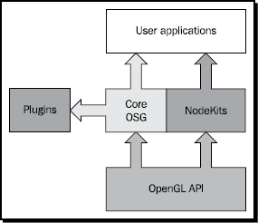

# 1 开启OpenSceneGraph之旅

> 在查看各种渲染效果和使用精心挑选的代码片段之前，让我们先了解一下OpenSceneGraph的历史，了解它的结构和功能，并加入社区来在线学习和讨论OSG。你将有机会创建一个OSG风格的“Hello World”应用程序，通过它你可以获得关于OSG语法和结构的必要信息。
>
> 本书中，**OSG** 为 **OpenSceneGraph** 的简写。为简便起见，本书主要使用简写。

在本章，我们将：

* 简要概述场景图概念和OSG的历史
* 了解最新版OSG的基本结构与特性 *（译者注：此处最新版指OSG3.0）*
* 使用一段简单代码亲身体验OSG
* 建立与OSG社区交互的连接

## 1.1 渲染中间件简明概览

在进入OSG的世界之前，假设你已经体验过OpenGL编程了。无论你是享受其中还是感到万分痛苦，你都要使用成堆的矩阵、设置管线状态、查找新的扩展、调用渲染API或命令，并立即在上下文中将数据绘制出来。

渲染中间件是提高抽象级别、以一定灵活性为代价来降低使用低级OpenGL API复杂性的解决方案。在用户程序中，模块化和面向对象的概念经常被应用于管理图元、材质和不同可视化数据集，这节省了大量的开发时间并允许新的功能可以按模块或插件的形式添加进来。

OSG是一款拥有良好设计的渲染中间件应用程序。它实际上是基于 **场景图** 原理的 **保留渲染**（或称延迟渲染）系统，在缓冲区记录渲染命令和数据并在其他时间执行。这允许系统在渲染之前执行各种优化操作，并可实现一个多线程策略来处理复杂场景。

## 1.2 场景图

**场景图** 是一个通用的数据结构，为了图形数据的高效管理和渲染它定义了图形场景的空间与逻辑关系。它是典型的层级图，包含一个顶级 **根节点**，若干能拥有任意数量 **子节点** 的 **组节点**，和一些没有子节点的 **叶节点**，叶节点组成树结构的最底一层。一个典型的场景图不允许存在环结构（一些节点连接成一个闭合链）或孤立元素（一个节点没有子节点或父节点）；

每个 **组节点** 可以拥有任意数量的孩子。将这些 **子节点** 组织在一起可以使它们共享父节点的信息，并能将它们视为一个整体。默认情况下，由父节点执行的操作会将其效果传递给所有孩子。

同样地，某些节点会有多个 **父节点**，此时这些节点被认为是“实体 (instanced)”，并且 **场景图** 可以被定义为 **有向无环图**。实例化 (instancing)产生了许多有趣的效果，包括数据共享和多通道渲染。

场景图的概念被广泛应用于许多现代化软件和应用程序中，例如AutoCAD、Maya、CorelDraw、VRML、Open Inventor和我们将要研究的——OpenSceneGraph。

## 1.3 OSG测诞生与发展

OpenSceneGraph项目是由Don Burns在1998年发起的。他曾为SGI工作，是一名滑翔爱好者。他在一个简易的Linux PC上写了一个简化的类SGI的 **场景图** API，命名为SG，这就是OSG的原型。

1999年，一位滑翔机制造商的设计顾问Robert Osfield开始参与这个年轻的项目。他建议将SG作为一个独立的 **开源** 项目继续开发，并很快将其元素移植到Windows中。那年年底，Robert接手了这个项目，并把它的名字改成了OpenSceneGraph。然后该项目被完全重写，以充分利用C++标准和设计模式。

2001年，为了回应人们对该项目日益增长的兴趣，Robert设立了公司 *OpenSceneGraph Professional Services*。他放弃了其他工作的机会，并全职提供商业和免费的OSG服务。Don也成立了自己的公司，*Andes Computer Engineering*，继续支持OSG的发展。

同年，在SIGGRAPH 2001大会期间举行了第一次OSG兴趣小组(BOF)会议，当时仅有12人参加。在那之后，OSG BOF的出席率每年都在增长，越来越多的人开始了解这个基于opengl的API。

2003年，起初为满足用户需要而创建以提供窗口和多管线图形系统集成能力的 **Producer** 库被添加进来，同时添加的还有另外两个重要的库，**osgText** 和 **osgFX**。随后在2005年，OSG 1.0发布，这成为邮件列表中1100多名成员的一大乐事。

2007年，发布了全新的OSG 2.0版本，提升了多核心、多CPU的支持，并添加了三个新库：**osgViewer**、**osgManipulator** 和 **osgShadow**。从那时起，开始使用统一构建系统CMake来简化项目工程构建过程。原 **Perducer** 被废弃并由 *Andes Computer Engineering* 公司作为独立项目进行维护。最早的两本关于OSG的图书 *OpenSceneGraph Quick Start Guide* 和 *OpenSceneGraph Reference Manuals* 也出版了。Paul Martz推荐所有场景图技术的新手开发者去阅读它们。

时间飞逝！一年又一年过去了，OSG一直保持着惊人的速度在发展：**osgWidget** 在2008年首次被引入；2009年 **osgVolume** 和 **osgAnimation** 出现；2010年伴随着即将发布的3.0版本 **osgQt** 诞生，同时还有对令人惊叹的OpenGL ES和OpenGL 3.0的支持。

现在，成百上千的高性能应用程序正在使用OSG渲染复杂场景和管理海量数据。在432个核心贡献者的巨大努力和世界各地软件开发人员的持续支持下，可以预见到OSG将会有一个非常光明的未来。

## 1.4 组件

OSG的基础结构具有高度的可伸缩性，以便能够在行运行时访问扩展功能。除了标准 **核心库** 之外，还提供了一组称为 **节点组件** 的附加模块库，以满足特定的开发需求。

OSG核心功能包括以下4部分：

1. **OpenThreads**：这个库的目的是为C++开发者提供一个完整且轻量化的面向对象线程接口。它被OSG用作主要的线程模型实现。
2. **osg**：这个库提供了组成场景图的基本元素，如节点、几何对象、渲染状态和纹理，以及相关的管理工具和函数。它还包含一些必要的数学类，用来实现在二维和三维空间中常用的向量和矩阵运算。
3. **osgDB**：此库为读写二维和三维数据文件提供了插件机制，其中包含了一个可派生类，它提供了对数据文件和输入输出流的操作方法。内置的分页数据库机制支持场景图片段的动态载入和卸载，以实现海量用户数据的调度。
4. **osgUtil**：这个库是为构建OSG渲染后端而设计的，实现场景树遍历、每一帧的场景裁剪，最后将OSG场景转换为一系列OpenGL调用。

当前发布的OSG可使用的额外 **节点组件** 和实用工具有：

+ **osgAnimation**：这个库为各种动画提供了一系列通用的实用工具，包括骨架和变形。它使用通用模板来构造多种关键帧和动画通道。
+ **osgFX**：此库包含一个在三维空间实现特效的框架，并提供了若干实用的特效类。
+ **osgGA (OSG GUI Abstraction)**：这个库是在各种窗体系统之上的抽象用户接口。它用来处理来自外围设备，如鼠标或键盘，的交互事件。
+ **osgManipulator**：此库扩展了场景图以支持对场景和可变换节点的三维交互操控，如平移、旋转和缩放。
+ **osgParticle**：此库使渲染爆炸、火焰、烟雾和其他基于粒子的效果成为可能。
+ **osgShadow**：此库提供了支持各种阴影绘制技术的框架。
+ **osgSim**：这个库可以满足来自仿真系统的一些特定需求，特别是来自OpenFlight数据库的特殊需求。
+ **osgTerrain**：这个库提利用高度场和图像数据来支持对地理地形的渲染。
+ **osgText**：此库基于FreeType项目完全支持绘制TrueType及各种其他类型字体。可在三维空间或屏幕上绘制三维和二维文字。
+ **osgViewer**：这个库定义了一组与视景器相关的类，集成了OSG场景图并基于各种窗体系统（包括Win32、X11、Carbon和Cocoa）渲染场景，另外还间接支持许多其他流行的GUI工具集。
+ **osgVolume**：此库包含对体绘制技术的基本支持。
+ **osgWidget**：此库对OSG核心元素进行了扩展，为三维应用提供了一系列二维GUI组件。
+ **osgQt**：这个库将Qt GUI嵌入到场景图中，因此可以在空间中显示web页面和普通Qt小部件。*（译者注：osgQt已经从OSG中移除，成为了独立项目）*

所有OSG **核心库** 和 **节点组件**，无论它们实现了什么特性或者是谁贡献了它们，其名称都有一样的前缀"osg"，随后是一个简短的单词或缩写作为关键词。

OSG的整体架构如下图所示：



大多数情况下，**osg**、**osgDB**、**osgUtil** 和 **osgViewer** 是基于OSG的应用的主要组件，在本书之后的章节将会讨论这些库的更多细节，其他不经常使用的 **节点组件** 可能会在特定章节内提到。

## 1.5 为什么用OSG

OSG项目是开源的，并在一个修改后的GNU通用公共许可证(LGPL)下发布，即OSGPL。它给用户带来了显著的好处：

+ **严谨的结构**：OSG充分使用了标准模板库(STL)即多种设计模式。它还利用开放源码开发模型，以提供一个无法律的、以用户为中心的应用程序编程接口。
+ **性能优越**：一系列的场景图技术已经在OSG中得到了很好的实现，包括视锥体和遮挡裁剪，多层次细节(LOD)配置，渲染状态排序，粒子和阴影技术，并且完整封装了OpenGL扩展和着色语言。
+ **高可扩展性**：OSG的核心功能结构明晰且是高度可扩展的。这使得用户很容易编写自定义的节点组件和文件读写插件，并将它们集成到场景图和应用程序中。
+ **软硬件层面的高可移植性**：OSG核心部分对任何特定的平台或窗口系统的依赖程度最低，只需要标准的C++和OpenGL。这使基于OSG的程序移植到Windows、Linux、Mac OSX、FreBSD、Solaris甚至嵌入式平台提供了极大的便利。
+ **跟进最新进展**：有了活跃的开发者社区，OSG的发展速度非常快。它支持最新的OpenGL和OpenGL ES扩展和各种图形概念和技术，并在开发迭代周期中获得了大量的反馈。
+ **开源**：在现代工业中，开源意味着协同智能(co-intelligence)、高质量和灵活性，而不仅仅是廉价。在自己的应用程序中使用OSG时，用户和公司也不必担心软件专利侵权。

## 1.6 谁在用OSG

下面粗略列举了一些使用OSG或将OSG作为其应用程序和产品开发工具的组织：

| Organization name | Download link(if downloadable) | Purpose using OSG |
| --- | --- | --- |
| Boeing | - | Flight simulation |
| Delta 3D | [www.delta3d.org](http://www.delta3d.org) | Game engine |
| Flight Gear | [www.flightgear.org](http://www.flightgear.org) | Flight simulation |
| Intra | - | Train simulation |
| Magic Earth | - | Oil and gas probing |
| NASA | - | Earth simulation |
| Norcontrol | - | Maritime simulation |
| ossimPlanet | [www.ossim.org](http://www.ossim.org/OSSIM/ossimPlanet.html) | Geo-spatial visualization |
| Virtual Terrain Project | [www.vterrain.org](http://www.vterrain.org) | CAD and GIS related fields |
| VR Juggler | [www.vrjuggler.org](http://www.vrjuggler.org) | Virtual reality system |

其他客户包括ESA、Landmark Graphics、Sony、STN Atlas、Northrop Grumman，甚至还有军事部门。要了解更多的基于OSG的项目和成果，只需搜索整个web，并通过web社区与世界各地的开发人员保持联系。

## 1.7 快速体验

在坐下来进行编码之前，你应该已经建立了一个OSG开发环境，其中包括 **头文件** 和 **库**，可通过获得与编译器版本兼容的预构建软件包，或者使用源代码构建所有内容。详情请参阅第2章OpenSceneGraph的编译和安装。

### 动手实践：编写OSG样式的"Hello World"程序

迫不及待地想体验一下OSG编程？这里有一个简单至极的例子，展示了如何加载一个现有的模型文件并将其呈现在屏幕上。这可比在控制台窗口打印出"Hello Wolrd"文本有趣多了：

1. 使用任何代码编辑器创建工程：

    ```c++
    #include <osgDB/ReadFile>
    #include <osgViewer/Viewer>
    int main(int argc, char **argv>
    {
        osgViewer::Viewer viewer;
        viewer.setSceneData(osgDB::readNodeFile("cessna.osg"));
        return viewer.run();
    }
    ```

2. 指定OSG **头文件** 位置和 **依赖库**。你需要告诉链接器将你的工程与以下5个库进行链接：**OpenThreads**、**osg**、**osgDB**、**osgUtil** 和 **osgViewer**。你将在下一章学习更多有关配置OSG应用程序的知识。
3. 构建你的工程。确保cessna.osg文件已经存在于可执行文件相同目录下或在环境变量 **OSG_FILE_PATH** 指定的文件夹中。
4. 快来看！你得到了一个全屏显示的窗口并在中间有一个飞行器：

    

5. 试着用你的鼠标对你所观察到的东西做出一些改变。当你移动鼠标时，按下并按住鼠标左键、中键和右键来旋转、移动和缩放cessna。注意你实际上并不是在修改模型，而是改变了虚拟视点。

#### 总结与探究

刚刚创建的这个简单易读的示例展示了OSG是多么的强大和简洁。函数 `osgDB::readNodeFile()` 用来读取一个已有的 **节点文件**，即呈现Cessna模型的 **场景图**。然后创建的 `osgViewer::Viewer` 实例用来设置场景数据，并为应用程序提供一个仿真循环以渲染数据。

这里 *osg* 和 *osgDB* 是命名空间，*Viewer* 是类名。函数和类成员的命名均采用“驼峰式”风格，即第一个单词的首字母为小写，随后的单词首字母为大写。

## 1.8 加入社区

欢迎所有对学习和使用OSG有兴趣的人在任何时候加入社区。有几种方法可以与核心开发团队和数千名OSG开发者取得联系。

公共邮件列表，最为推荐的方式。这里的一个邮件列表是一个订阅者列表，他们通过电子邮件讨论同一个特定的主题。通过以下链接订阅OSG邮件列表：

| Mailing list | Subscription link | Description |
| --- | -- | --- |
| osg-users | [http://lists.openscenegraph.org/listinfo.cgi/osg-usersopenscenegraph.org](http://lists.openscenegraph.org/listinfo.cgi/osg-usersopenscenegraph.org) | General technique support and discussions |
| osg-submissions | [http://lists.openscenegraph.org/listinfo.cgi/osgsubmissions-openscenegraph.org](http://lists.openscenegraph.org/listinfo.cgi/osgsubmissions-openscenegraph.org) | Submission of code changes and bug fixes only |

论坛，实质上已经与邮件列表联系在一起，提供给喜欢论坛这种形式的人：[http://forum.openscenegraph.org](http://forum.openscenegraph.org)。

你也可以在网络上找到各式各样的OSG讨论组，比如在IRC channel、Google group、LinkedIn，甚至还有中国的镜像站。

+ irc.freenode.net #openscenegraph
+ http://groups.google.com/group/osg-users/topics
+ http://www.linkedin.com/e/gis/61724/6F710C14EBAF
+ http://bbs.osgchina.org/

公司和个人也可以通过支付适当的费用来寻求专业服务。这里列出了一些专业的OSG承包商，作为参考：
http://www.openscenegraph.org/projects/osg/wiki/Community/Contractors。

最后，请记住随时访问维基网站和开发者博客。这包含了大量的信息，包括最新的新闻和OSG发行版的下载链接：

+ http://www.openscenegraph.org/
+ http://blog.openscenegraph.org/

## 总结

