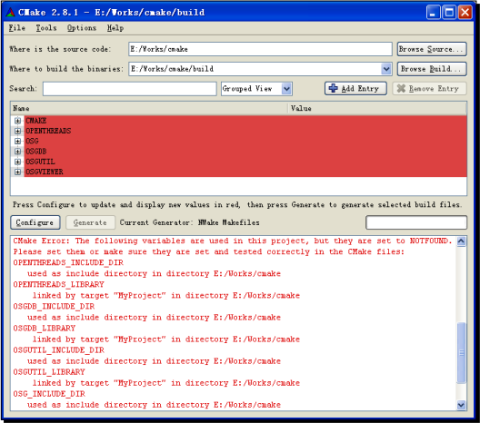
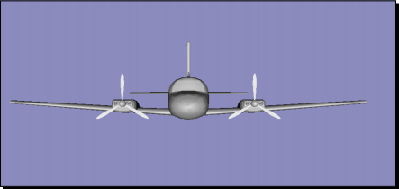
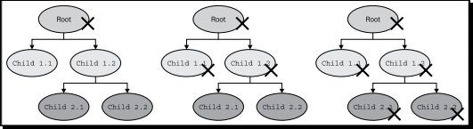
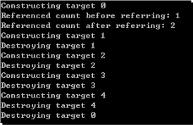
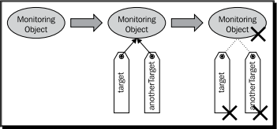
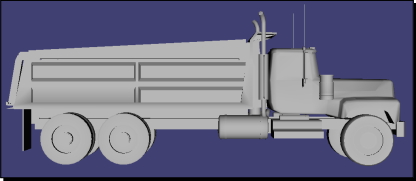

# Chapter 3 : 创建你的第一个OSG程序

> 本章示范了一种创建OSG程序的一般方法。使用CMake编译系统能够快速的在不同系统平台上构建解决方案和编译所需的文件，本章结尾处将会讨论CMake的相关内容。OSG原生的内存管理机制也会在本章进行详细的讲解，此机制可有效的避免程序在 **运行时 (run-time)** 的内存泄漏，并且OSG还支持优雅的 **参数解析器 (argument parser)** 和用于调试的 **消息通知器 (message notifier)**，在本章亦会着重介绍。

在本章，我们将：

+ 展示如何利用CMake工具创建和运行你的第一个OSG程序
+ 讨论如何利用OSG原生 **智能指针 (smart pointer)** 进行全自动地垃圾回收和内存释放
+ 介绍怎样使用参数解析器从命令行中读取参数
+ 利用消息通知器来跟踪和调试OSG程序

***

## 3.1 构建你自己的项目

为了从你自己的的源代码中创建可运行的程序，首先创建一个基于特定平台的解决方案是必不可少的一步。对于使用Windows系统的开发者，我们已经在上一章介绍了一个项目模板工具。但是这个模板对UNIX和Mac OS以及在Windows系统上使用MinGW与Cygwin的开发者是没用的。

在本章的开始部分，我们将介绍另一种利用CMake基于特定系统平台的创建工程项目的方法，通过这种方法，我们可以将注意力集中在代码本身而不用关注复杂的程序编译和构建过程。

### 动手实践 : 用CMake创建应用程序

在你使用CMake脚本创建你自己的项目之前，首先将头文件和源文件放到同一个空目录下将有助于后续的工作。第二步是使用任意一款文本编辑器创建一个 `CMakeLists.txt` 文件，然后开始写入一些简单的CMake语句。

1. 以下代码实现了一个项目，此项目使用了OSG相关的头文件和依赖库。请将这些代码输入到刚刚创建的 `CMakeLists.txt` 文件中。

```cmake
cmake_minimum_required( VERSION 2.6 )
project( MyProject )

find_package( OpenThreads )
find_package( osg )
find_package( osgDB )
find_package( osgUtil )
find_package( osgViewer )

macro( config_project PROJNAME LIBNAME )
    include_directories( ${${LIBNAME}_INCLUDE_DIR} )
    target_link_librarues( ${PROJNAME} ${${LIBNAME}_LIBRARY} )
endmacro()

add_executable( MyProject main.cpp )
config_project( MyProject OPENTHREADE )
config_project( MyProject OSG )
config_project( MyProject OSGDB )
config_project( MyProject OSGUTIL )
config_project( MyProject OSGVIEWER )
```

2. 我们只添加了一个源文件 `main.cpp`，这个文件组成了 `HelloWorld` 示例程序并被编译成名为 `MyProject` 的可执行文件。这个小项目依赖于5个OSG的主要组件。后续章节会给出一些示例，来展示所有这些配置都能被修改，以适应特定的需求和不同的用户程序。

3. 下一步，启动程序 `cmake-gui` 并且将 `CMakeLists.txt` 拖进图形界面窗口。当前，你可能并不熟悉CMake脚本是怎样被执行的。不过，[CMake wiki](https://gitlab.kitware.com/cmake/community/wikis/Home) 上的资料会对你深入了解CMake大有帮助。

4. 模仿上一章的步骤来创建一个 `Visual Studio solution` 或一个 `makefile`。

5. 唯一要注意的一点是要保证你所使用的CMake软件是2.6或更高版本，并且你已经设置了环境变量 `OSG_ROOT`。否则，`find_package()` 宏指令将不能正确找到OSG的组件。下面这张图片展示了由于未找到OSG头文件及运行库而导致的一系列出乎意料的错误。

    

6. 注意，在 `Visual Studio solution` 中没有 `INSTALL` 项目，或是任何 `make install` 命令用来运行，这是由于我们并没有为编译后生成的组件写相关的CMake脚本。你可以在可执行文件所在目录直接运行它。

#### *刚才发生了什么？*

CMake提供了易于阅读的命令用来为用户项目自动寻找依赖项。它将检查预设的目录和环境变量来寻找任何需要的头文件和运行库。

在UNIX和Windows系统下，环境变量 `OSG_ROOT` (`OSG_DIR` 亦可)将有助于搜索OSG的相关文件，因为CMake会首先搜索预设的合法路径，检查是否有预编译的OSG头文件和运行库。

### 小测验 : 自己完成OSG路径的配置

你的CMake由于特殊原因不能找到OSG的头文件和其他开发所需的文件，例如，头文件和运行库在不同的位置，或者你想要使用其他的OSG发行版，但这个发行版没有使用 `OSG_ROOT` 或 `OSG_DIR`。

你能靠自己设置CMake的选项吗？通常，OSG相关的一组开发库(`OPENTHREADS`，`OSG`，`OSGDB` 等等)有3个选项，分别是 `OSG_INCLUDE_DIR`，`OSG_LIBRARY` 和 `OSG_LIBRARY_DEBUG`。你认为，它们各是什么意思呢？

### 试一试 : 用不同编译器测试你的程序

尝试用一用各种编译器来生成你的项目，如 `Visual Studio`， `MinGW`， `UNIX`编译器。你会发现CMake是一款十分方便的工具来帮助你在各种不同的平台上通过源代码编译二进制文件。或许这是让你学习使用多平台风格进行软件开发的一个不错的开始。

## 3.2 使用根节点

现在我们将写一些代码并使用自定义的CMake脚本来编译它。我们将再一次对多次使用的“Hello World”示例程序进行一点修改。

### 动手实践 : 升级“Hello World”示例程序

包含的头文件 `<osgDB/ReadFile>` 和 `<osgViewer/Viewer>` 无需修改。我们仅仅添加一个变量 `root` 在运行时访问Cessna模型并将其赋值给 `setSceneData()` 方法。

1. 在主函数 `main` 中，用名叫 `root` 的变量存储Cessna模型。

```c++
osg::ref_ptr<osg::Node> root = osgDB::readNodeFile("cessna.osg");
osgViewer::Viewer viewer;
viewer.setSceneData( root.get() );
return viewer.run();
```

2. 编译并运行程序。

    

3. 你会发现这和之前的示例程序“Hello World”没什么两样，那么究竟发生了什么？

#### *刚才发生了什么？*

在本例，我们提到了两个新OSG类型 `osg::ref_ptr<>` 和 `osg::Node`。类 `osg::Node` 代表了 **场景图 (scene graph)** 的基础元素。变量 `root` 代表Cessna模型的 **根节点 (root node)**，并作为场景数据来被可视化。

同时，类模板 `osg::ref_ptr<>` 的实例用来管理节点对象。这是一种 **智能指针**，提供了额外的特性来实现高效的 **内存管理 (memory management)**。

## 3.3 理解内存管理

在传统的开发场景中，开发者需要为 **根节点** 创建指针，来直接或间接地管理场景内所有 **孩子节点 (child nodes)**。这种情况下，程序需要遍历 **场景图** 并极为小心地删除不再需要渲染的节点及其内部数据。由于对于一个指向将要被删除的对象的指针，开发者并不知道有多少其他对象仍然保有它，往往调试中会遇到大量 **结构糟糕的树 (bad trees)** 和 **野指针 (wild pointers)**，所以这个处理过程是极其繁琐并极易出错的。然而，如果没有管理数据的代码，那么所有场景节点占据的数据段将不会被删除掉，这将导致不可预料的内存泄漏。

以上就是在OSG开发过程中内存管理为什么如此重要的原因。内存管理的基本概念总是涉及两个方面：

1. **内存分配 (allocation)**：为对象分配一块必须的内存空间。
2. **解除分配 (deallocation)**：当数据不再需要时，回收内存空间以备重新利用。

在一些现代编程语言，例如 `C#`，`Java` 和 `Visual Basic`，使用垃圾回收器释放那些程序内任何变量都不会访问的内存空间。这意味着需要保存每个存储块被引用次数，当引用次数减少到0时释放对应的内存空间。

标准 `C++` 没有上述那样的运行机制，但我们能通过 **智能指针** 的方式来模仿它，智能指针被定义为与指针有类似行为的对象，但在内存管理方面更加智能。例如，`boost` 库提供了类模板 `boost::shared_ptr<>` 用来存储动态申请的对象指针。

## 3.4 ref_ptr<>及Referenced类型

幸运的是，OSG也提供了原生的智能指针，`osg::ref_ptr<>`，用以动态垃圾回收和内存释放。为了使其正确运行，OSG还提供了类 `osg::Referenced` 管理被引用计数的内存区块，并且此类是任何用作智能指针模板参数的类型的基类。

类模板 `osg::ref_ptr<>` 重载了一些 `C++` 操作符，使其对于开发者更加易用。主要内容如下：

+ **`get()`**：公共方法，返回管理的指针，例如，以 `osg::Node` 类型为模板参数时返回指针 `osg::Node*`。
+ **`operator*()`**：解引用操作符，返回指针地址的 **左值 (l-value)**，例如，返回引用变量 `osg::Node&`。
+ **`operator->()`** 和 **`operator=()`**：这些操作符使得用户程序可以像普通指针一样使用 `osg::ref_ptr<>`。前者会调用其管理对象的成员函数，后者会将一个新指针替换当前管理的指针。
+  **`operator==()`**， **`operator!=()`** 和  **`operator!()`**：这些操作符用来执行智能指针间的比较操作，或检查一个特定指针是否有效。一个赋值为 `NULL` 值或没有任何赋值的 `osg::ref_ptr<>` 对象将被认为是无效的。
+  **`valid()`**：公共方法，当被管理的指针不为 `NULL` 时返回 `true`。例如，假设 `some_ptr` 被定义为一个智能指针，那么语句 `some_ptr.valid()` 和 `some_ptr != NULL` 是等价的。
+  **`release()`**：公共方法，在函数返回其管理的指针时很有用。后续将对它进行进一步讨论。

类 `osg::Referenced` 是场景图内所有元素的基类，如普通节点，几何图形节点，渲染状态节点以及任何其他可分配的场景对象。类 `osg::Node` 是间接继承自类 `osg::Referenced` 的。这就是为什么我们能写下如下代码：

```c++
osg::ref_ptr<osg::Node> root;
```

类  `osg::Referenced` 包含一个整数来控制已被分配的内存区块。**引用计数 (reference count)** 在构造函数内被初始化为0，并当   `osg::Referenced` 对象被一个智能指针 `osg::ref_ptr<>` 引用时增加1。反之，若该对象由一个特定的智能指针移除时引用计数减少1。对象在没有智能指针引用时自动的被销毁。

类  `osg::Referenced` 提供了3个主要成员方法：

+ **`ref()`**：公共方法，使引用计数增加1。
+ **`unref()`**：公共方法，使引用计数减少1。
+ **`referenceCount()`**：返回当前引用计数的数值，在调试程序是很有用。

这些方法在类 `osg::Referenced` 的派生类中同样可以使用。注意，在用户程序中极少情况下需要直接调用 `ref()` 或 `unref()` 方法，直接调用它们意味着需要人工管理引用计数，并且易于智能指针的自动化操作发生冲突。另外，OSG内部的垃圾回收系统将会获得错误的智能指针数量，甚至会使用非正常方式管理内存而导致程序崩溃。

## 3.5 垃圾回收 : 为何需要及如何实现

这里有一些在开发中使用智能指针和垃圾回收系统的理由：

+ **更少的bug**：使用智能指针意味着能够自动初始化和清理指针。由于有引用计数所以不会有悬挂指针出现。
+ **高效的管理**：对象在不被引用时立即被销毁，可以在有限资源的情况下给程序提供更多可用内存。
+ **方便调试**：我们可以很容易的观察对象的引用计数和其他信息，并可将这些信息用于其他优化和实验。

例如，一个场景树由一个 **根节点** 组成，并且有若干层级的子节点。假设所有孩子节点都是用 `osg::ref_ptr<>` 管理，用户程序只保有根节点的指针。正如下图所示，删除根节点的操作会引起连锁反应使所有层级的节点都被销毁。



在示例图中每个节点都被其父节点管理。并且在父节点被删除过程中自动减少引用。一个节点如果不再被其他节点引用，将会被立即销毁，并且释放它的孩子节点。整个场景树会在最后一个 **组节点 (group node)** 或 **叶节点 (leaf node)** 删除后被完全清理干净。

这个过程非常方便和高效，是吧？请用以下步骤保证智能指针能为你所用，使用 `osg::Referenced` 的派生类型作为 `osg::ref_ptr<>` 的模板参数，将新分配的对象正确的赋值给智能指针。

智能指针可以作为局部变量，全局变量亦或类内成员变量，并能在被赋值为另一个对象或跳出作用域时完全自动化地减少引用计数。

强烈建议用户程序总是使用智能指针来管理场景，但是仍有一些情况需要特别关注：

+ 类 `osg::Referenced` 及其派生类的对象只允许在堆内创建。这些类型实例不能作为局部变量使用，因为出于安全性的考虑，类的析构函数被声明为 **受保护的 (protected)**。例如：

```c++
osg::ref_ptr<osg::Node> node = new osg::Node;  // 合法
osg::Node node;  // 不合法
```

+ 常规 `C++` 指针仍是可用的，但是用户程序应该记得将它赋值给智能指针或是添加到场景的元素中(几乎所有OSG场景类型都用智能指针管理孩子节点)，因为这是最安全的指针使用方法。

```c++
osg::Node* temNode = new osg::Node;  // 做法尚可
// ...
osg::ref_ptr<osg::Node> node = temNode;  // 最佳实践
```

+ 不要设置 **循环引用 (reference cycle)**，因为垃圾回收机制不能处理这种情况。引用循环指一个节点直接或间接地引用自己，它将导致引用计数的错误计算。

下图展示了两种引用循环，这两种引用方式都是无效的。节点 `node 1.1` 直接将自己设置为子节点，这将在遍历其孩子节点时导致死循环，因为它也是它本身的孩子。节点 `node 2.2` 间接地引用自己，会在遍历节点时导致同样的问题。


现在，我们通过一个非常简单的例子来加深对内存管理这个概念的理解。

## 3.6 追踪被管理的实体

我们感兴趣的关键点是 `osg::ref_ptr<>` 是怎样与一个 `osg::Referenced` 对象进行绑定并控制它的，以及被管理的对象在何时被销毁。我们当前已经了解的是：当被管理对象不再被任何智能指针引用或其引用者离开了作用域时会自动的被销毁。现在，我们在实践中来看一看这是如何实现的。

### 动手实践 : 监控被计数的对象

我们首先声明一个继承自 `osg::Referenced` 的自定义类。这样就可以使用智能指针并受益于垃圾回收系统。然后，让我们看看被引用对象的初始化和清理过程。

1. 包含必要的头文件

```c++
#include <osg/ref_ptr>
#include <osg/Referenced>
#include <iostream>
```

2. 定义我们的类 `MonitoringTarget`，此类包含一个唯一标识符 `_id`。当类对象被构造或销毁时我们将使用标准输出来打印详细信息。

```c++
class MonitoringTarget : public osg::Referenced
{
public:
    MonitoringTarget(int id) : _id(id)
    { std::cout << "Constructing target " << _id << std::end; }

protected:
    virtual ~MonitoringTarget()
    { std::cout << "Destroying target " << _id << std::endl; }

    int _id;
}
```

3. 在主函数中，我们首先创建一个 `MonitoringTarget` 对象，并将其赋值给两个不同的智能指针 `target` 和 `anotherTarget`，然后我们观察引用计数如何变化。

```c++
osg::ref_ptr<MonitoringTarget> target = new MonitoringTarget(0);
std::cout << "Referenced count before referring: "
          << target->referenceCount() << std::endl;
osg::ref_ptr<MonitoringTarget> anotherTarget = target;
std::cout << "Referenced count after referring: "
          << target->referenceCount() << std::endl;
```

4. 第二个实验是在循环中创建新对象，但是不删除他们。你认为这是否会引发内存泄漏？

```c++
for (unsigned int i = 1; i < 5; ++i)
{
    osg::ref_ptr<MonitoringTarget> subTarget =
        new MonitoringTarget(i);
}
```

5. 程序打印的结果如以下截图所示。对象构造过程和析构过程的都被写入到标准输出，在控制台窗口呈现出一个信息列表。

    

#### *刚才发生了什么？*

一个新创建的ID号为0的 `MonitroingTarget` 对象赋值给一个智能指针 `target`。另外一个智能指针 `anotherTarget` 随即引用了这个对象，将对象的引用计数增加到2，这意味着这个对象同时被两个智能指针引用。如图所示，这个对象在所有引用者指向其他对象或被销毁时才被删除。



然后，我们在循环中创建了ID号为1到4的 `MonitoringTarget` 对象。每一次循环，分配的对象被设置到一个 `osg::ref_ptr<>` 指针中，但这个对象不会被严格的删除。但你会发现对象会在每次循环结束时被自动地删除，并不会引起内存泄漏。

另外一个有趣的问题是选择最佳的时刻去实际地删除不再被引用的对象。大多数基于 `osg::Referenced` 的类将析构函数声明为受保护的成员，所以C++的 `delete` 操作符不能直接的应用到这些类的对象上。对象的删除过程会在引用计数减少到0时在内部执行。但是，如果一个对象在被删除的过程中其他线程还在基于此对象工作，这仍会引起严重的问题。这就是说，垃圾回收系统在大规模使用时也许不是线程安全的。

幸运的是，OSG已经提供了一个对象删除调度器来应对这个问题。这个删除调度器叫做 `osg::DeleteHandler`，它不会立即执行删除操作，而是延迟一小段时间。所有需要删除的对象将临时存储起来，直到一个安全的时刻来销毁它们。这个类 `osg::DeleteHandler` 被OSG的渲染后台管理。用户程序不用过多地关注这个类，除非某天你需要自己实现一个删除调度器。

### 试一试 : 从函数返回对象指针

我们已经提到过当从一个函数返回对象指针时有一个方法 `release()` 可供使用。以下代码将会提示你关于它更多的使用细节：

```c++
MonitoringTarget* createMonitoringTarget(unsigned int id)
{
    osg::ref_ptr<MonitoringTarget> target = new MonitoringTarget(id);
    return target.release();
}
```

试着将语句 `new MonitoringTarget(i)` 替换为这个函数。这达到了从函数返回指针的目的，并且没有任何副作用。

### 小测验 : 释放一个智能指针

我们知道，类 `osg::ref_ptr<>` 中的 `release()` 方法将使智能指针不再管理它本来指向的内存。在 *试一试* 一节提到的函数中，`release()` 首先将引用计数减少到0，然后，返回实际指针而不删除内存数据。只要调用代码将指针保存到另外的 `osg::ref_ptr<>` 类对象后，将不会引发内存泄漏。

那么如果这个函数返回时使用的是 `target.get()` 而不是 `target.release()` 将会发生什么？你能指出为什么 `release()` 能始终正确的从函数中返回对象的地址吗？

## 3.6 解析命令行参数

传入主函数的命令行参数可以为用户程序定义不同的参量。主函数的声明形式一般都是这样的：

```c++
int main(int argc, char** argv);
```

参数 `argc` 和字符串数组 `argv` 包含了程序名称和其他必要的参数。OSG提供了高效、安全的类 `osg::ArgumentParser` 来读取并使用这些参数。

### 动手实践 : 从命令行参数中读取模型的文件名

类 `osg::ArgumentParser` 最常用的公共方法是重载方法 `read()` 。在这个示例中，我们使用一个特殊格式读取命令行参数，并将解析结果用于读取模型文件。

1. 包含必要头文件

```c++
#include <osgDB/ReadFile>
#include <osgViewer/Viewer>
```

2. 在主函数内，尝试从命令行参数中读取选项 `--model` 以及对应的文件名。

```c++
osg::ArgumentParser arguments(&argc, argv);
std::string filename;
arguments.read("--model", filename);
```

3. 从指定文件内读取节点并初始化 **视景器 (viewer)**，这与之前的例子很相似，只是这个用一个 `std::string` 对象替代了常量字符串 `Cessna.osg`。

```c++
osg::ref_ptr<osg::Node> root = osgDB::readNodeFile(filename);
osgViewer::Viewer viewer;
viewer.setSceneData(root.get());
return viewer.run();
```

4. 编译并运行这个例子！假设你的可执行文件名为 `MyProject.exe`，在 **命令提示符窗口 (prompt)** 键入以下命令：

```
# MyProject.exe --model dumpttruck.osg
```

5. 我们现在从硬盘内载入了一个自卸卡车模型，不再是仅仅能看Cessna模型了。当然你需要明确的是已经安装了OSG示例数据并设置了环境变量 `OSG_FILE_PATH`。

    

#### *刚才发生了什么？*

自卸卡车模型被加载到内存并被绘制到屏幕上。这里，最重要的一点是文件名 `dumptruck.osg` 是从命令行参数中获取的。方法 `read()`，包含一个格式字符串参数和一个结果参数，成功找到了第一个出现用户自定义选项 `--model` 的位置和紧随其后的文件名参数。

类 `osg::ArgumentParser` 的方法 `read()` 是重载的。除了字符串，你可能会从命令行参数中获取整型数、单精度和双精度浮点数、甚至数学向量。例如，从命令行中用自定义的选项 `--size` 读取一个单精度数值，就可使用如下代码：

```c++
float size = 0.0f;
arguments.read("--size", size);
```

如果命令行中没有 `--size` 这样的参数，变量 `size` 的初值是不会改变的。

## 3.7 使用通知器追踪信息

OSG通知器机制提供了一种新方法输出详细的调试信息，无论是OSG渲染后台或是用户级代码都可以使用。对于追踪和调试程序来讲，这是一个非常重要并且久享赞誉的方法。另外，通知器广泛应用在OSG核心功能和插件中，来显示错误、警告信息，或是工作流中的提示信息。开发者可以随意地将用于调试的打印函数添加到源代码中。这个打印函数，`osg::notify()`，接收不同级别的信息并将它们发送到控制台或用户定义的控制器。

函数 `osg::notify()` 可以当做标准输出流 `std::cout` 使用。它需要一个 `NotifySeverity` 参数指定消息的级别。消息级别从高到低依次排列为 `ALWALS`，`FATAL`，`WARN`，`NOTICE`，`INFO`，`DEBUG_INFO` 和 `DEBUG_FP`。例如：

```c++
osg::notify(osg::WARN) << "Some warn message." << std::endl;
```

默认情况下这句代码打印一行警告信息。这里的 `osg::WARN` 被用来向OSG通知器系统指定消息的级别。

一些宏定义，例如 `OSG_FATAL`，`OSG_WARN` 和 `OSG_NOTICE`，与指定了相应级别的 `osg::notify()` 功能一致。

## 3.8 重定向通知器

OSG输出的消息总是包含关于运行状态、图形系统扩展、OSG后台潜在问题以及用户程序的重要信息。这也是调试基于OSG的程序的重要资料。

某些情况下，一个程序没有控制台输出窗口，这阻止了我们通过阅读通知器消息来寻找潜在bug。然而，`osg::NotifyHandler` 的派生类能将通知器重定向到另一个输出系统，例如文件或GUI组件。

### 动手实践 : 保存日志文件

我们将使用类 `std::ofstream` 将OSG内部通知器消息重定向到一个外部文件。重写 `osg::NotifyHandler` 派生类的虚方法 `notify()` 来应用标准文件流的操作，并在各项功能开始前调用全局函数 `osg::setNotifyHandler()`。

1. 包含必要文件

```c++
#include <osgDB/ReadFile>
#include <osgViewer/Viewer>
#include <fstream>
```

2. 实现派生类 `LogFileHandler`，它将通知消息重定向到文件流。

```c++
class LogFileHandler : public osg::NotifyHandler
{
public:
    LogFileHandler(const std::string& file)
    { _log.open(file.c_str()); }
    virtual ~LogFileHandler() { _log.close(); }

    virtual void notify(osg::NotifySeverity severity,
                        const char* msg)
    { _log << msg; }

protected:
    std::oftream _log;
};
```

3. 现在向OSG系统设置一个新的通知器，并设置消息级别为 **INFO** 来查看更多详细信息。函数 `osg::readNodeFile` 直接使用来自命令行的所有可用文件名读取数据，并将它们合并到根节点。我们还添加了一个 `OSG_FATAL` 宏定义检查是否没有数据加载进来。

```c++
int main(int argc, char** argv)
{
    osg::setNotifyLevel(osg::INFO);
    osg::setNotifyHandler(new LogFileHandler("output.txt"));

    osg::ArgumentParser arguments(&argc, argv);
    osg::ref_ptr<osg::Node> root = osgDB::readNodeFiles(arguments);
    if (!root)
    {
        OSG_FATAL << arguments.getApplicationName()
                  << ": No data loaded." << std::endl;
        return -1;
    }

    osgViewer::Viewer viewer;
    viewer.setSceneData(root.get());
    return viewer.run();
}
```

4. 编译并运行示例。所有信息，包括示例代码设置的信息，都将保存在日志文件 `output.txt` 内。试着用以下命令运行新生成的可执行文件 `MyProject.exe`：

```
# MyProject.exe dumptruck.osg
```

5. 按 *Esc* 键退出程序，使用任何文本编辑器打开工作目录的日志文件，其结果与下图类似：

    

6. 如果你不能理解列出的所有信息也请不要灰心。这仅仅是显示了OSG是如何启动并使各部分正确运行的。在将来的开发中这些信息会给予你很大帮助。

#### *刚才发生了什么？*

默认情况下，OSG会将消息发送至标准输出流 `std::cout` 和错误信息流 `std::cerr`。然而，这些信息可以轻易地重定向到其他流甚至GUI文本窗口。在终端用户发送回馈时，日志文件将起到很大的帮助作用。

此外，使用函数 `osg::setNotifyLevel()` 会将通知级别修改为为一个特定级别。低于设定级别的消息会被通知器系统略掉。例如，假设你在你的程序中写了如下代码：

```c++
osg::setNotifyLevel(osg::FATAL);
// ...
osg::notify(osg::WARN) << "Some warn message." <<std::endl;
```

级别低于 `FATAL` 的通知器发出的消息将不会被输出。

在前文章节提到的环境变量 `OSG_NOTIFY_LEVEL` 能控制任何基于OSG的程序输出消息的级别。

## 总结

本章提供了一个简明教程引导大家使用CMake工具创建自己第一个简单的OSG程序，并介绍了一些实用工具。OSG **大量使用** 智能指针来高效的控制运行时分配给每个场景节点的系统资源，这对于寻求极高安全性的程序来说是至关重要的。为了帮助理解智能指针的工作原理，在本章用了较大篇幅解释 `osg::ref_ptr<>` 的用途以及如何计算引用计数，还讨论了在管理OSG场景元素时可能出现的几种情况。

在本章，我们具体介绍了：

* 如何基于你自己的源代码和OSG依赖项编写简单的CMake脚本并让他正确工作
* 智能指针的工作原理和OSG的垃圾回收机制
* 使用原生智能指针管理场景对象的优势和注意事项
* 一些用于解析命令行参数和用于追踪调试的实用类型