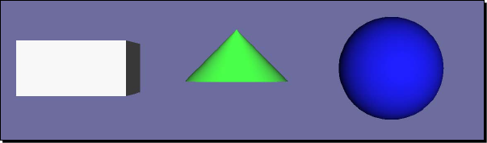

# chapter4：创建几何模型

> OpenGL图形管线的基本运算是接收顶点数据（点、线、三角形和多边形）和像素数据（图形图像数据），将它们转换为 **片元 (fragments)** 并存储到 **帧缓存 (frame buffer)** 中。帧缓存在开发者与计算机显示之间充当主要接口，为读写操作将每一帧的图形内容映射到内存空间。OSG封装了OpenGL整个顶点转换和图元集操作，以便管理和发送顶点数据到OpenGL渲染管线，另外还包含了一些数据传输优化和额外的多边形技术来提高渲染性能。

在本章，我们集中学习如何快速的绘制和渲染几何模型，接下来将涉及以下内容：

* 如何使用几个必要的参数快速地绘制基本图形对象
* 如何设置顶点和顶点属性数组来构建几何对象
* 按图元索引顶点数据的原因和方法
* 如何使用不同的多边形技术优化渲染过程
* 如何获取几何属性和图元
* 集成OpenGL绘制调用到你的OSG应用程序

---

## 4.1 OpenGL是怎样绘制对象的

在3D环境下，OpenGL使用 **几何图元 (geometry primitives)** 绘制不同的对象。几何图元，可能是一组点、线、三角形或多边形面，决定了OpenGL如何排列和渲染相关的顶点数据。渲染图元最简单的方式是在 `glBegin()` 和 `glEnd()` 之间列举一系列顶点，这称作是 **即时模式 (immediate mode)**，但在很多情况下这是很低效的做法。

顶点数据包括顶点坐标、法向量、颜色和纹理坐标，被存储在一系列数组中。图元就是通过引用和索引数组元素而组成的。这种被称为 **顶点数组 (vertex array)** 的方法减少了冗余的共享顶点，因此比即时模式效率更高。

**显示列表 (display lists)** 也能显著的提高程序的性能，因为所有顶点和像素数据进行了编译并被复制到图形内存中。预处理好的图元可以被重复使用，避免了数据一次又一次的传输。这在绘制静态几何图形时很有帮助。

**顶点缓存对象 (vertex buffer object, VBO)** 机制允许 **顶点数组** 存储到高性能内存中，这为传输动态数据提供了一个更高效的解决方案。

默认情况下，OSG使用 **顶点数组** 和 **显示列表** 管理和渲染几何图形，不过可以根据不同的数据类型和渲染策略而做出改变。

需要提示大家的是，OpenGL ES和OpenGL 3.x版本为了提供更轻量化的接口，移除了 **即时模式** 和 **显示列表**。当然，OpenGL 3.x和将来的版本会保留这些过时接口来保持向后兼容。不过，不推荐在新代码里使用它们。

## 4.2 Geode和Drawable类型

类 `osg::Geode` 对应场景的 **叶节点 (leaf node)**。它没有孩子节点但总是包含用于渲染的几何信息。它的名字 `Geode` 是 `geometry node` 的简称。

用于绘制的几何数据存储在一组被 `osg::Geode` 管理的 `osg::Drawable` 对象内。类 `osg::Drawable` 是纯虚类，不能实例化。它有一系列子类用于向OpenGL管线渲染模型、图片和文本。这些可渲染元素统称为 **可绘制对象 (drawables)**。

类 `osg::Geode` 提供了一些方法来关联和移除可绘制对象，以及收集相关信息：

1. 公共方法 `addDrawable()` 以一个 `osg::Drawable` 指针作为参数，使 `osg::Geode` 示例与一个可绘制对象进行关联。所有添加的可绘制对象都是由智能指针 `osg::ref_ptr<>` 管理。

2. 公共方法 `removeDrawable()` 和 `removeDrawables()` 可以从当前 `osg::Geode` 对象中移除一个或多个可绘制对象，当然会减少这些可绘制对象的引用计数。方法 `removeDrawable()` 以 `osg::Drawable` 指针作为唯一参数，方法 `removeDrawables()` 接受两个参数：第一个是以0为基准的索引，指定起始元素位置；第二个是要移除元素的个数。

3. 方法 `getDrawable()` 返回指定索引对应的 `osg::Drawable` 对象。

4. 方法 `getNumDrawables()` 返回关联的可绘制对象的总数。开发者可以在循环中使用方法 `getDrawable()` 遍历每个可绘制对象，或者使用一下代码一次移除所有可绘制对象。

```c++
geode->removeDrawables(0, geode->getNumDrawables());
```

## 4.3 绘制基本图形

OSG提供了类 `osg::ShapeDrawable`，这个类继承自 `osg::Drawable` 并可以使用简单的参数快速地渲染出基本几何图形。类 `osg::ShapeDrawable` 实例需要包含一个 `osg::Shape` 对象，此对象定义了几何图形的类型和属性。

方法 `setShape()` 一般用来申请并设置图形对象。例如：

```c++
shapeDrawable->setShape(new osg::Box(osg::Vec3(1.0f, 0.0f, 0.0f), 10.0f, 10.0F, 5.0f));
```

以上代码将设置一个在其相对坐标系中以点(1.0, 0.0, 0.0)为中心、宽高分别为10和5的盒子。这里的类 `osg::Vec3` 在OSG中代表了3维向量。其他预定义的类型例如 `osg::Vec2` 和 `osg::Vec4` 会帮助我们定义顶点、颜色、法向量和纹理坐标。

需要注意的是，`osg::Vec3` 指的是单精度浮点数类型的向量，而 `osg::Vec3d` 指双精度浮点数类型的向量，其它类型如 `osg::Vec2` 与 `osg::Vec2d`、`osg::Vec4` 与 `osg::Vec4d` 具有相同含义。

OSG内定义的最常用的基本图形是：`osg::Box`、`osg::Capsule`、`osg::cone`、`osg::Cylinder` 和 `osg::Sphere`。传递给构造函数的参数将会很好的定义它们的具体外观形状。

### 动手实践：快速创建简单对象

使用某个 `osg::Shape` 的子类创建简单对象是非常容易的。我们将用三种典型图形作为例子：具有不同宽度、高度、深度值的立体盒，具有半径值的椭球和具有半径值、高度值的圆锥体。

1. 包含必要的头文件：

```c++
#include <osg/ShapeDrawable>
#include <osg/Geode>
#include <osgViewer/Viewer>
```

2. 添加3个 `osg::ShapeDrawable` 对象，每个对象含有一个基本图形。我们将这些图形对象设置到不同位置以便于能同时在视景窗口中观察它们，为了更好的区分它们，我们利用 `osg::ShapeDrawable` 类的 `setColor()` 函数将后两个图形一个染成绿色另一个染成蓝色。

```c++
osg::ref_ptr<osg::ShapeDrawable> shape1 = new osg::ShapeDrawable;
shape1->setShape(new osg::Box(osg::Vec3(-3.0f, 0.0f, 0.0f), 2.0f, 2.0f, 1.0f));

osg::ref_ptr<osg::ShapeDrawable> shape2 = new osg::ShapeDrawable;
shape2->setShape(new osg::Sphere(osg::Vec3(3.0f, 0.0f, 0.0f), 1.0f));
shape2->setColor(osg::Vec4(0.0f, 0.0f, 1.0f, 1.0f));

osg::ref_ptr<osg::ShapeDrawable> shape3 = new osg::ShapeDrawable;
shape3->setShape(new osg::Cone(osg::Vec3(0.0f, 0.0f, 0.0f), 1.0f, 1.0f));
shape3->setColor(osg::Vec4(0.0f, 1.0f, 0.0f, 1.0f));
```

3. 创建一个 `osg::Geode` 对象并将所有可绘制对象添加进去。注意这里所有的可绘制对象和几何节点均是由智能指针 `osg::ref_ptr<>` 管理。最后， `osg::Geode` 对象作为视景器的场景根节点进行显示。

```c++
osg::ref_ptr<osg::Geode> root = new osg::Geode;
root->addChild(shape1.get());
root->addChild(shape2.get());
root->addChild(shape3.get());

osgViewer::Viewer viewer;
viewer.setSceneData(root.get());
return viewer.run();
```

4. 现在是时候检查一下图形是否被正确绘制了。我们无需关心实际与顶点坐标、法向量和颜色相关的处理工作，这给程序调试带来便利并能快速预览图形。



#### *到底发生了什么*

在需要快速显示图形时 `osg::ShapeDrawable` 类非常有用，但这并不是高效的 **几何基元 (geometry primitives)** 绘制方式。当你开发3D应用过程中，它应该仅在原型设计或调试时使用。如要创建能满足高效计算和可视化性能的几何图形，接下来即将介绍的 `osg::Geometry` 类永远是更好的选择。

OSG拥有一个内部类 `osg::GLBeginEndAdapter`，它被用来执行基本的图形绘制操作。这个类能够将 **顶点数组 (vertex arrays)** 转为使用 `glBegin()` 和 `glEnd()` 函数对的形式，这种形式将基本图形的具体实现变得易于理解和扩展。

如要获取并使用已完成初始化的 `osg::GLBeginEndAdapter` 对象，你应该定义一个继承自 `osg::Drawable` 的子类并重写它的 `drawImplementation()` 函数，写下基本的OpenGL 1.0的绘制调用：

```c++
void drawImplementation(osg::RenderInfo &renderInfo) const
{
    osg::GLBeginEndAdapter &gl = renderInfo.getState()->getGLBeginEndAdapter();
    gl.Begin( ... );
    gl.Vertex3fv( ... );
    gl.End();
}
```

在本章 *实现你自定义的可绘制对象* 一节将提到更多有关重写 `osg::Drawable` 类的信息。

## 4.4 存储数组数据

前文章节已经提到，OSG支持使用 **顶点数组 (vertex array)** 和 **顶点缓存对象 (VBO)** 加快渲染过程。为了在这两种机制中管理顶点数据，OSG定义了一个数组基类 `osg::Array` 及其若干子类充当常用的数组和索引数组类型。

`osg::Array` 类不能被实例化，但它定义了与“OpenGL调用”或“缓存对象”交换数据的接口。它的子类（`osg::Vec2Array`，`osg::Vec3Array`，`osg::UIntArray` 等等）同时继承了标准模板库(STL) 数组类，所以能够使用所有 `std::vector` 的成员，包括 `push_back()`、`pop_back()`、`size()` 函数以及STL算法和迭代器。

下面的代码将会向现有 `osg::Vec3Array` 对象 *vertices* 中添加一个三元向量：

```c++
vertices->push_back(osg::Vec3(1.0f, 0.0f, 0.0f));
```

OSG内置的数组类型应该从堆上创建并使用智能指针管理。然而，对于数组元素例如 `osg::Vec2` 或 `osg::Vec3` 则无需遵循这个规则，因为它们是非常基础的数据类型。

`osg::Geometry` 类是OpenGL顶点数组功能的高级封装。它记录不同类型的数组并管理集合图元集将顶点数据有序地渲染出来。它继承自 `osg::Drawable` 类并可随时添加到 `osg::Geode` 类对象中。此类接受若干作为基础数据载体的数组并利用它们生成简单或复杂的几何模型。

## 4.5 顶点与顶点属性

顶点是几何图元的基本元素，它使用若干数值属性描述一个2D或3D空间的点，这些属性包括顶点位置、颜色、法线以及纹理坐标、雾坐标等等。位置值是必需的，其他属性用来辅助定义点的特性。OpenGL允许为每个顶点指定多达16个通用属性，并可以使用不同的方式创建和存储它们。类 `osg::geometry` 支持所有的属性数组，可通过对应的 `set*Array()` 函数进行设置。

OpenGL内置的顶点属性如下表所示：

| Attribute | Suggested data type | osg::Geometry method | Equivalent OpenGL call |
| --- | --- | --- | --- |
| Position | 3D vectors | setVertextArray() | glVertexPointer() |
| Normal | 3D vectors normalized to the range [0, 1] | setNormalArray() | glNormalPointer |
| Color | 4D vectors normalized to the range [0, 1] | setColorArray() |  glColorPointer|
| Secondary color | 4D vectors normalized to the range [0, 1] | setSecondaryColorArray() | glSecondaryColorPointerEXT() |
| Fog coordinate | Float values | setFogCoordArray() | glFogCoordPointerEXT() |
| Texture coordinate | 2D or 3D vectors | setTexCoordArray() | glTesCoordPointer() |
| Other general attributes | User-defined values | setVertexAttribArray() | glVertexAttribPointerEXT() |

在当前的OpenGL图形系统中，一个顶点通常包含8个纹理坐标和三个通用属性。原则上，应该为每个顶点的所有属性都设置具体的值，形成一组具有完全相同大小的数组，否则未定义的属性可能会引起意料之外的问题。OSG提供了绑定函数使得为顶点指定属性这一工作变得方便简单[^1]。例如，`geom` 为类 `osg::Geometry` 的对象，开发者以一个枚举值为参数调用此类的共有函数 `setColorBinding()`：

```c++
geom->setColorBinding(osg::Geometry::BIND_PER_VERTEX);
```

这句代码表明颜色和顶点被设置成一对一的对应关系。然而，来看下面的代码：

```c++
geom->setColorBinding(osg::Geomtry::BIND_OVERALL);
```

这将会用一个单一颜色值应用到整个几何对象上。此外还有 `setNormalBinding()`、`setSecondaryColorBinding()`、`setFogColorBinding()` 和 `setVertexAttribBinding()` 函数为其他类型属性做类似的绑定工作。

[^1]: 译者注-本文提到的顶点属性绑定函数已经标记为过时。

## 4.6 指定绘制类型

设置完顶点的属性数组后，下一步就要告诉 `osg::Geometry` 对象如何渲染它们。虚基类 `osg::PrimitiveSet` 就是用来管理 **几何基元 (geometry primitive)** 组的，几何基元记录了顶点的绘制顺序信息。类 `osg::Geometry` 提供了一些公共函数来操作一个或多个几何基元组：

1. 函数 `addPrimitiveSet()` 以一个 `osg::PrimitiveSet` 类指针为参数并将此基元组绑定到 `osg::Geometry` 对象上。
2. 函数 `removePrimitiveSet()` 需要两个参数，一个为基于0的索引值，另一个是需要删除的基元组的个数。它能移除一个或多个已绑定的基元组。
3. 函数 `getPrimitiveSet()` 返回特定索引位置的 `osg::PrimitiveSet` 对象的指针。
4. 函数 `getNumPrimitiveSets()` 返回基元组的总数。

类 `osg::PrimitiveSet` 是不能被直接实例化的，但它有一些子类用来封装OpenGL的 `glDrawArrays()` 和 `glDrawElements()` 函数入口，例如 `osg::DrawArrays` 类和 `osg::DrawElementsUInt` 类。

类 `osg::DrawArrays` 使用 **顶点数组 (vertex array)** 中若干元素序列来构造一系列 **几何基元 (geometry primitives)**。可以使用如下代码创建此类对象并将其绑定到 `osg::Geometry` 对象 `geom`上：

```c++
geom->addPrimitiveSet(new osg::DrawArrays(mode, first, count);
```

第一个参数 `mode` 指定了绘制何种基元。如同OpenGL的 `glDrawArrays()` 接口一样，`osg::DrawArrays` 可接受10种基元类型：`GL_POINTS`，`GL_LINE_STRIP`，`GL_LINE_LOOP`，`GL_LINES`，`GL_TRIANGLE_STRIP`，`GL_TRIANGLE_FAN`，`GL_TRIANGLES`，`GL_QUAD_STRIP`，`GL_QUADS` 和 `GL_POLYGON`。

第二和第三个参数指定了基元组起始于索引 *`first`* 处并共有 *`count`* 个元素。开发者应该保证顶点数组内至少有 *`first + count`* 个元素。OSG不会检查顶点个数是否满足几何基元组的需求，如不满足将会引发程序崩溃。

