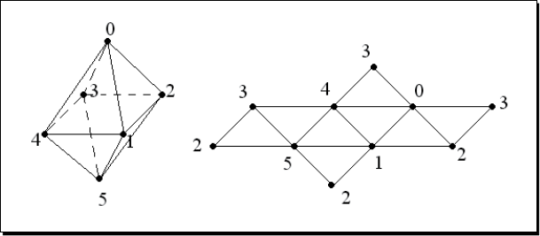

# 4 创建几何模型

> OpenGL图形管线的基本运算是接收顶点数据（点、线、三角形和多边形）和像素数据（图形图像数据），将它们转换为 **片元 (fragments)** 并存储到 **帧缓存 (frame buffer)** 中。帧缓存在开发者与计算机显示之间充当主要接口，为读写操作将每一帧的图形内容映射到内存空间。OSG封装了OpenGL整个顶点转换和图元集操作，以便管理和发送顶点数据到OpenGL渲染管线，另外还包含了一些数据传输优化和额外的多边形处理技术来提高渲染性能。

在本章，我们集中学习如何快速的绘制和渲染几何模型，接下来将涉及以下内容：

* 如何使用几个必要的参数快速地绘制基本图形对象
* 如何设置顶点和顶点属性数组来构建几何对象
* 按图元索引顶点数据的原因和方法
* 如何使用不同的多边形处理技术优化渲染过程
* 如何获取几何属性和图元
* 集成OpenGL绘制调用到你的OSG应用程序

---

## 4.1 OpenGL是怎样绘制对象的

在3D环境下，OpenGL使用 **几何图元 (geometry primitives)** 绘制不同的对象。几何图元，可能是一组点、线、三角形或多边形面，决定了OpenGL如何排列和渲染相关的顶点数据。渲染图元最简单的方式是在 `glBegin()` 和 `glEnd()` 之间列举一系列顶点，这称作是 **即时模式 (immediate mode)**，但在很多情况下这是很低效的做法。

顶点数据包括顶点坐标、法向量、颜色和纹理坐标，被存储在一系列数组中。图元就是通过引用和索引数组元素而组成的。这种被称为 **顶点数组 (vertex array)** 的方法减少了冗余的共享顶点，因此比即时模式效率更高。

**显示列表 (display lists)** 也能显著的提高程序的性能，因为所有顶点和像素数据进行了编译并被复制到图形内存中。预处理好的图元可以被重复使用，避免了数据一次又一次的传输。这在绘制静态几何图形时很有帮助。

**顶点缓存对象 (vertex buffer object, VBO)** 机制允许 **顶点数组** 存储到高性能内存中，这为传输动态数据提供了一个更高效的解决方案。

默认情况下，OSG使用 **顶点数组** 和 **显示列表** 管理和渲染几何图形，不过可以根据不同的数据类型和渲染策略而做出改变。

需要提示大家的是，OpenGL ES和OpenGL 3.x版本为了提供更轻量化的接口，移除了 **即时模式** 和 **显示列表**。当然，OpenGL 3.x和将来的版本会保留这些过时接口来保持向后兼容。不过，不推荐在新代码里使用它们。

## 4.2 Geode和Drawable类型

类 `osg::Geode` 对应场景的 **叶节点 (leaf node)**。它没有孩子节点但总是包含用于渲染的几何信息。它的名字 `Geode` 是 `geometry node` 的简称。

用于绘制的几何数据存储在一组被 `osg::Geode` 管理的 `osg::Drawable` 对象内。类 `osg::Drawable` 是纯虚类，不能实例化。它有一系列子类用于向OpenGL管线渲染模型、图片和文本。这些可渲染元素统称为 **可绘制对象 (drawables)**。

类 `osg::Geode` 提供了一些方法来关联和移除可绘制对象，以及收集相关信息：

1. 公共方法 `addDrawable()` 以一个 `osg::Drawable` 指针作为参数，使 `osg::Geode` 示例与一个可绘制对象进行关联。所有添加的可绘制对象都是由智能指针 `osg::ref_ptr<>` 管理。

2. 公共方法 `removeDrawable()` 和 `removeDrawables()` 可以从当前 `osg::Geode` 对象中移除一个或多个可绘制对象，当然会减少这些可绘制对象的引用计数。方法 `removeDrawable()` 以 `osg::Drawable` 指针作为唯一参数，方法 `removeDrawables()` 接受两个参数：第一个是以0为基准的索引，指定起始元素位置；第二个是要移除元素的个数。

3. 方法 `getDrawable()` 返回指定索引对应的 `osg::Drawable` 对象。

4. 方法 `getNumDrawables()` 返回关联的可绘制对象的总数。开发者可以在循环中使用方法 `getDrawable()` 遍历每个可绘制对象，或者使用一下代码一次移除所有可绘制对象。

```c++
geode->removeDrawables(0, geode->getNumDrawables());
```

## 4.3 绘制基本图形

OSG提供了类 `osg::ShapeDrawable`，这个类继承自 `osg::Drawable` 并可以使用简单的参数快速地渲染出基本几何图形。类 `osg::ShapeDrawable` 实例需要包含一个 `osg::Shape` 对象，此对象定义了几何图形的类型和属性。

方法 `setShape()` 一般用来申请并设置图形对象。例如：

```c++
shapeDrawable->setShape(new osg::Box(osg::Vec3(1.0f, 0.0f, 0.0f), 10.0f, 10.0F, 5.0f));
```

以上代码将设置一个在其相对坐标系中以点(1.0, 0.0, 0.0)为中心、宽高分别为10和5的盒子。这里的类 `osg::Vec3` 在OSG中代表了3维向量。其他预定义的类型例如 `osg::Vec2` 和 `osg::Vec4` 会帮助我们定义顶点、颜色、法向量和纹理坐标。

需要注意的是，`osg::Vec3` 指的是单精度浮点数类型的向量，而 `osg::Vec3d` 指双精度浮点数类型的向量，其它类型如 `osg::Vec2` 与 `osg::Vec2d`、`osg::Vec4` 与 `osg::Vec4d` 具有相同含义。

OSG内定义的最常用的基本图形是：`osg::Box`、`osg::Capsule`、`osg::cone`、`osg::Cylinder` 和 `osg::Sphere`。传递给构造函数的参数将会很好的定义它们的具体外观形状。

### 动手实践：快速创建简单对象

使用某个 `osg::Shape` 的子类创建简单对象是非常容易的。我们将用三种典型图形作为例子：具有不同宽度、高度、深度值的立体盒，具有半径值的椭球和具有半径值、高度值的圆锥体。

1. 包含必要的头文件：

    ```c++
    #include <osg/ShapeDrawable>
    #include <osg/Geode>
    #include <osgViewer/Viewer>
    ```

2. 添加3个 `osg::ShapeDrawable` 对象，每个对象含有一个基本图形。我们将这些图形对象设置到不同位置以便于能同时在视景窗口中观察它们，为了更好的区分它们，我们利用 `osg::ShapeDrawable` 类的 `setColor()` 函数将后两个图形一个染成绿色另一个染成蓝色。

    ```c++
    osg::ref_ptr<osg::ShapeDrawable> shape1 = new osg::ShapeDrawable;
    shape1->setShape(new osg::Box(osg::Vec3(-3.0f, 0.0f, 0.0f), 2.0f, 2.0f, 1.0f));

    osg::ref_ptr<osg::ShapeDrawable> shape2 = new osg::ShapeDrawable;
    shape2->setShape(new osg::Sphere(osg::Vec3(3.0f, 0.0f, 0.0f), 1.0f));
    shape2->setColor(osg::Vec4(0.0f, 0.0f, 1.0f, 1.0f));

    osg::ref_ptr<osg::ShapeDrawable> shape3 = new osg::ShapeDrawable;
    shape3->setShape(new osg::Cone(osg::Vec3(0.0f, 0.0f, 0.0f), 1.0f, 1.0f));
    shape3->setColor(osg::Vec4(0.0f, 1.0f, 0.0f, 1.0f));
    ```

3. 创建一个 `osg::Geode` 对象并将所有可绘制对象添加进去。注意这里所有的可绘制对象和几何节点均是由智能指针 `osg::ref_ptr<>` 管理。最后， `osg::Geode` 对象作为视景器的场景根节点进行显示。

    ```c++
    osg::ref_ptr<osg::Geode> root = new osg::Geode;
    root->addChild(shape1.get());
    root->addChild(shape2.get());
    root->addChild(shape3.get());

    osgViewer::Viewer viewer;
    viewer.setSceneData(root.get());
    return viewer.run();
    ```

4. 现在是时候检查一下图形是否被正确绘制了。我们无需关心实际与顶点坐标、法向量和颜色相关的处理工作，这给程序调试带来便利并能快速预览图形。

    

#### *总结与探究*

在需要快速显示图形时 `osg::ShapeDrawable` 类非常有用，但这并不是高效的 **几何图元 (geometry primitives)** 绘制方式。当你开发3D应用过程中，它应该仅在原型设计或调试时使用。如要创建能满足高效计算和可视化性能的几何图形，接下来即将介绍的 `osg::Geometry` 类永远是更好的选择。

OSG拥有一个内部类 `osg::GLBeginEndAdapter`，它被用来执行基本的图形绘制操作。这个类能够将 **顶点数组 (vertex arrays)** 转为使用 `glBegin()` 和 `glEnd()` 函数对的形式，这种形式将基本图形的具体实现变得易于理解和扩展。

如要获取并使用已完成初始化的 `osg::GLBeginEndAdapter` 对象，你应该定义一个继承自 `osg::Drawable` 的子类并重写它的 `drawImplementation()` 函数，写下基本的OpenGL 1.0的绘制调用：

```c++
void drawImplementation(osg::RenderInfo &renderInfo) const
{
    osg::GLBeginEndAdapter &gl = renderInfo.getState()->getGLBeginEndAdapter();
    gl.Begin( ... );
    gl.Vertex3fv( ... );
    gl.End();
}
```

在本章 *实现你自定义的可绘制对象* 一节将提到更多有关重写 `osg::Drawable` 类的信息。

## 4.4 存储数组数据

前文章节已经提到，OSG支持使用 **顶点数组 (vertex array)** 和 **顶点缓存对象 (VBO)** 加快渲染过程。为了在这两种机制中管理顶点数据，OSG定义了一个数组基类 `osg::Array` 及其若干子类充当常用的数组和索引数组类型。

`osg::Array` 类不能被实例化，但它定义了与“OpenGL调用”或“缓存对象”交换数据的接口。它的子类（`osg::Vec2Array`，`osg::Vec3Array`，`osg::UIntArray` 等等）同时继承了标准模板库(STL) 数组类，所以能够使用所有 `std::vector` 的成员，包括 `push_back()`、`pop_back()`、`size()` 函数以及STL算法和迭代器。

下面的代码将会向现有 `osg::Vec3Array` 对象 *vertices* 中添加一个三元向量：

```c++
vertices->push_back(osg::Vec3(1.0f, 0.0f, 0.0f));
```

OSG内置的数组类型应该从堆上创建并使用智能指针管理。然而，对于数组元素例如 `osg::Vec2` 或 `osg::Vec3` 则无需遵循这个规则，因为它们是非常基础的数据类型。

`osg::Geometry` 类是OpenGL顶点数组功能的高级封装。它记录不同类型的数组并管理集合图元集将顶点数据有序地渲染出来。它继承自 `osg::Drawable` 类并可随时添加到 `osg::Geode` 类对象中。此类接受若干作为基础数据载体的数组并利用它们生成简单或复杂的几何模型。

## 4.5 顶点与顶点属性

顶点是几何图元的基本元素，它使用若干数值属性描述一个2D或3D空间的点，这些属性包括顶点位置、颜色、法线以及纹理坐标、雾坐标等等。位置值是必需的，其他属性用来辅助定义点的特性。OpenGL允许为每个顶点指定多达16个通用属性，并可以使用不同的方式创建和存储它们。类 `osg::geometry` 支持所有的属性数组，可通过对应的 `set*Array()` 函数进行设置。

OpenGL内置的顶点属性如下表所示：

| Attribute | Suggested data type | osg::Geometry method | Equivalent OpenGL call |
| --- | --- | --- | --- |
| Position | 3D vectors | setVertextArray() | glVertexPointer() |
| Normal | 3D vectors normalized to the range [0, 1] | setNormalArray() | glNormalPointer |
| Color | 4D vectors normalized to the range [0, 1] | setColorArray() |  glColorPointer|
| Secondary color | 4D vectors normalized to the range [0, 1] | setSecondaryColorArray() | glSecondaryColorPointerEXT() |
| Fog coordinate | Float values | setFogCoordArray() | glFogCoordPointerEXT() |
| Texture coordinate | 2D or 3D vectors | setTexCoordArray() | glTesCoordPointer() |
| Other general attributes | User-defined values | setVertexAttribArray() | glVertexAttribPointerEXT() |

在当前的OpenGL图形系统中，一个顶点通常包含8个纹理坐标和三个通用属性。原则上，应该为每个顶点的所有属性都设置具体的值，形成一组具有完全相同大小的数组，否则未定义的属性可能会引起意料之外的问题。OSG提供了绑定函数使得为顶点指定属性这一工作变得方便简单。例如，`geom` 为类 `osg::Geometry` 的对象，开发者以一个枚举值为参数调用此类的共有函数 `setColorBinding()`：

```c++
geom->setColorBinding(osg::Geometry::BIND_PER_VERTEX);
```

这句代码表明颜色和顶点被设置成一对一的对应关系。然而，来看下面的代码：

```c++
geom->setColorBinding(osg::Geomtry::BIND_OVERALL);
```

这将会用一个单一颜色值应用到整个几何对象上。此外还有 `setNormalBinding()`、`setSecondaryColorBinding()`、`setFogColorBinding()` 和 `setVertexAttribBinding()` 函数为其他类型属性做类似的绑定工作。

*（译者注：本文提到的顶点属性绑定函数已经标记为过时。）*

## 4.6 指定绘制类型

设置完顶点的属性数组后，下一步就要告诉 `osg::Geometry` 对象如何渲染它们。虚基类 `osg::PrimitiveSet` 就是用来管理 **几何图元 (geometry primitive)** 组的，几何图元记录了顶点的绘制顺序信息。类 `osg::Geometry` 提供了一些公共函数来操作一个或多个几何图元：

1. 函数 `addPrimitiveSet()` 以一个 `osg::PrimitiveSet` 类指针为参数并将此图元绑定到 `osg::Geometry` 对象上。
2. 函数 `removePrimitiveSet()` 需要两个参数，一个为基于0的索引值，另一个是需要删除的图元的个数。它能移除一个或多个已绑定的图元。
3. 函数 `getPrimitiveSet()` 返回特定索引位置的 `osg::PrimitiveSet` 对象的指针。
4. 函数 `getNumPrimitiveSets()` 返回图元的总数。

类 `osg::PrimitiveSet` 是不能被直接实例化的，但它有一些子类用来封装OpenGL的 `glDrawArrays()` 和 `glDrawElements()` 函数入口，例如 `osg::DrawArrays` 类和 `osg::DrawElementsUInt` 类。

类 `osg::DrawArrays` 使用 **顶点数组 (vertex array)** 中若干元素序列来构造一系列 **几何图元 (geometry primitives)**。可以使用如下代码创建此类对象并将其绑定到 `osg::Geometry` 对象 `geom`上：

```c++
geom->addPrimitiveSet(new osg::DrawArrays(mode, first, count);
```

第一个参数 `mode` 指定了绘制何种图元。如同OpenGL的 `glDrawArrays()` 接口一样，`osg::DrawArrays` 可接受10种图元类型：`GL_POINTS`，`GL_LINE_STRIP`，`GL_LINE_LOOP`，`GL_LINES`，`GL_TRIANGLE_STRIP`，`GL_TRIANGLE_FAN`，`GL_TRIANGLES`，`GL_QUAD_STRIP`，`GL_QUADS` 和 `GL_POLYGON`。

第二和第三个参数指定了图元起始于索引 *`first`* 处并共有 *`count`* 个元素。开发者应该保证顶点数组内至少有 *`first + count`* 个元素。OSG不会检查顶点个数是否满足几何图元的需求，如不满足将会引发程序崩溃。

### 动手实践：绘制一个彩色的四边形

让我们从一个常规图形做起来看看完成一个可绘制的几何模型有哪些步骤。我们将创建一个四边形，仅用四个顶点作为它的角点即可，并使用 `GL_QUADS` 模式绘制这些顶点。`GL_QUADS` 模式告诉OpenGL将顶点数组的第一组四个坐标组合为一个四元组，第二组四个坐标为一个四元组，以此类推。

1. 包含必要的头文件
    ```c++
    #include <osg/Geometry>
    #include <osg/Geode>
    #include <osgViewer/Viewer>
    ```

2. 创建顶点数组并使用类似 `std::vector` 的操作将四个角点依次放入数组尾部。

    ```c++
    osg::ref_ptr<osg::Vec3Array> vertices = new osg::Vec3Array;
    vertices->push_back(osg::Vec3(0.0f, 0.0f, 0.0f));
    vertices->push_back(osg::Vec3(1.0f, 0.0f, 0.0f));
    vertices->push_back(osg::Vec3(1.0f, 0.0f, 1.0f));
    vertices->push_back(osg::Vec3(0.0f, 0.0f, 1.0f));
    ```

3. 我们需要为每个顶点指定法向量，否则OpenGL将会使用默认值(0, 0, 1)且会得到错误的光照计算结果。这四个顶点实际上面向同一方向，所以一个法向量就足够了。我们后续还要使用 `BIND_OVERALL` 调用函数 `setNormalBinding()` 使法向量属性正确绑定到顶点。

    ```c++
    osg::ref_ptr<osg::Vec3Array> normals = new osg::Vec3Array;
    normals->push_back(osg::Vec3(0.0f, -1.0f, 0.0f));
    ```

4. 为每个顶点定义一个唯一的颜色值来使其着色。默认情况下，OpenGL会使用平滑的着色方式并将每个顶点的颜色混合在一起：

    ```c++
    osg::ref_ptr<osg::Vev4Array> colors = new osg::Vec4Array;
    colors->push_back(osg::Vec4(1.0f, 0.0f, 0.0f, 1.0f));
    colors->push_back(osg::Vec4(0.0f, 1.0f, 0.0f, 1.0f));
    colors->push_back(osg::Vec4(0.0f, 0.0f, 1.0f, 1.0f));
    colors->push_back(osg::Vec4(1.0f, 1.0f, 1.0f, 1.0f));
    ```

5. 接下来我们创建 `osg::Geometry` 对象并将预先准备好的顶点数组、法向量数组和颜色数组设置给它。同时要指定单个法向量应该被绑定到整个集合对象上，颜色值应被绑定到对应顶点上。

    ```c++
    osg::ref_ptr<osg::Geometry> quad = new osg::Geometry;
    quad->setVertexArray(vertices.get());
    quad->setNormalArray(normals.get());
    quad->setNormalBinding(osg::Geometry::BIND_OVERALL);
    quad->setColorArray(colors.get());
    quad->setColorBinding(osg::Geometry::BIND_PER_VERTEX);
    ```
6. 将几何对象放入场景前所需的最后一步是指定几何图元。这里使用具有 `GL_QUADS` 模式的 `osg::DrawArrays` 对象实例将作为四边形角点的四个顶点以逆时针方向绘制出来。

    ```c++
    quad->addPrimitiveSet(new osg::DrawArrays(GL_QUADS, 0, 4));
    ```

7. 将几何对象添加到 `osg::Geode` 对象中并将它放入场景内进行渲染。

    ```c++
    osg::ref_ptr<osg::Geode> root = new osg::Geode;
    root->addDrawable(quad.get());

    osgViewer::Viewer viewer;
    viewer.setSceneData(root.get());
    return viewer.run();
    ```

8. 我们的程序最终将呈现一个颜色很漂亮的四边形，如图所示：

    

#### *总结与探究*

假设你熟悉以下OpenGL代码片段：

```c
static const GLfloat vertices[][3] = { /*...*/ };
glEnableClientState(GL_VERTEX_ARRAY);
glVertexPointer(4, GL_FLOAT, 0, vertices);
glDrawArrays(GL_QUADS, 0, 4);
```

数组变量 `vertices` 用来定义被渲染的顶点坐标。OpenGL函数 `glDrawArrays()` 使用数组中的连续4个元素按 `GL_QUADS` 模式绘制几何图元，即三维空间中的四边形。

类 `osg::Geometry` 主要通过 `setVertexArray()` 和 `addPrimitiveSet()` 函数将上述整个过程封装了起来。实际上，顶点数据和图元的相关设置并不会在用户程序调用这些函数时立即执行，而是在下次场景遍历绘制过程到达此几何对象时才会生效。这使得在不需强制场景来回渲染的情况下能够使用 `osg::Geometry` 的大多数函数进行属性的读取和修改。

### 小测试：尝试不同图元类型

在前面的例子中，我们为图元定义了 *`mode`*、*`start`* 和 *`count`* 三个参数并得到了一个四边形。而对你重要的一点是要理解几何对象顶点是如何被一个或多个图元解译的。你能在一个表格中列举出那10中模式对应的符号（`GL_TRIANGLES`、`GL_QUADS` 等等）以及它们的主要行为吗？例如，某个模式如何对待顶点和索引，最终会绘制什么图形？

## 4.7 基于索引的图元

当直接从数组汇总读取连续的顶点数据（读取过程不会忽略任何顶点）时，`osg::DrawArrays` 类能够胜任相关绘制工作。然而，如果有许多共享顶点时它就变得不太高效了。例如，通过 `osg::DrawArrays` 使用8个顶点在 `GL_TRIANGLES` 模式下绘制一个立方体，每个顶点都会在顶点数组内重复好几次，数组大小会至少增加到36（12个三角面片）：


类 `osg::DrawElementsUInt`以及 `osg::DrawElementsUByte`、`osg::DrawElementUShort` 以索引数组的形式解决上述问题。它们均继承自 `osg::PrimitiveSet` 并且封装了OpenGL的 `glDrawElements()` 函数，仅数据类型不同。索引数组保存顶点数组元素的索引值。在此例中，使用相关基于索引的图元后，几何对象立方体的顶点数组大小就可保持为8了。

类 `osg::DrawElements*` 与 `std::vector` 有类似的使用方式。例如，可按如下代码这样向一个新创建的 `osg::DrawElementsUInt` 对象添加索引：

```c++
osg::ref_ptr<osg::DrawElementsUInt> de = new sog::DrawElementsUInt(GL_TRIANGLES);
de->push_back(0); de->push_back(1); de->push_back(2);
de->push_back(3); de->push_back(0); de->push_back(2);
```

这段代码定义了上一张图片中立方体的前表面。

### 动手实践：绘制一个八面体

八面体是由8个三角面组成的多面体，它是一个向我们展示图元索引是多么的重要的极佳例子。我们先描绘出八面体的结构，如下图所示：



八面体有6个顶点，每个顶点被4个三角面共用。当使用 `osg::DrawArrays` 时我们不得不创建一个具有24个元素的顶点数组来绘制这8个三角面。然而，在类 `osg::DrawElementsUInt` 和索引数组的帮助下，我们只需创建仅有6个元素的顶点数组，而这样显著提高了几何绘制的效率。

1. 包含必要头文件

    ```c++
    #include <osg/Geometry>
    #include <osg/Geode>
    #include <osgUtil/SmoothingVisitor>
    #include <osgViewer/Viewer>
    ```

2. 正如前面讨论的那样，类 `osg::Vec3Array` 继承了 `std::vector` 的特征，所以可以通过一个预定义的尺寸参数构造特定大小的实例，然后直接使用 `[]` 操作符对其进行修改。

    ```c++
    osg::ref_ptr<osg::Vec3Array> vertices = new osg::Vec3Array(6);
    (*vertices)[0].set( 0.0f, 0.0f, 1.0f);
    (*vertices)[1].set(-0.5f,-0.5f, 0.0f);
    (*vertices)[2].set( 0.5f,-0.5f, 0.0f);
    (*vertices)[3].set( 0.5f, 0.5f, 0.0f);
    (*vertices)[4].set(-0.5f, 0.5f, 0.0f);
    (*vertices)[5].set( 0.0f, 0.0f,-1.0f);
    ```

3. 类 `osg::DrawElementsUInt` 除了绘制模式参数还需要一个数字作为参数来定义其大小。然后，我们指定顶点索引来描述这八个三角形面。

    ```c++
    osg::ref_ptr<osg::DrawElementsUInt> indices = new osg::DrawElementsUInt(GL_TRIANGLES, 24);
    (*indices)[0]  = 0; (*indices)[1]  = 1; (*indices)[2]  = 2;
    (*indices)[3]  = 0; (*indices)[4]  = 2; (*indices)[5]  = 3;
    (*indices)[6]  = 0; (*indices)[7]  = 3; (*indices)[8]  = 4;
    (*indices)[9]  = 0; (*indices)[10] = 4; (*indices)[11] = 1;
    (*indices)[12] = 5; (*indices)[13] = 2; (*indices)[14] = 1;
    (*indices)[15] = 5; (*indices)[16] = 3; (*indices)[17] = 2;
    (*indices)[18] = 5; (*indices)[19] = 4; (*indices)[20] = 3;
    (*indices)[21] = 5; (*indices)[22] = 1; (*indices)[23] = 4;
    ```

4. 为了是创建的几何对象拥有默认的白色，我们只设置顶点数组和 `osg::DrawElementdsUInt` 图元即可。法向量数组也是必需的，但是手动计算并不容易。我们将使用平滑法向计算器自动的获取顶点法向量。这个计算器将在下一章 *使用多边形处理技术* 有进一步描述。

    ```c++
    osg::ref_ptr<osg::Geometry> geom = new osg::Geometry;
    geom->setVertexArray(vertices.get());
    geom->addPrimitiveSet(indices.get());
    osgUtil::SmoothingVisitor::smooth(*geom);
    ```

5. 将几何对象添加至一个 `osg::Geode` 对象中，并将此对象设置为场景根节点：

    ```c++
    osg::ref_ptr<osg::Geode> root = new osg::Geode;
    root->addDrawable(geom.get());

    osgViewer::Viewer viewer;
    viewer.setSceneData(root.get());
    return viewer.run();
    ```

6. 生成的八面体如下图所示：

    

#### *总结与探究*

**顶点数组 (vertex array)** 机制减少了OpenGL函数的调用次数。**客户端 (client side)** 将顶点数据存储在应用程序内存中，**服务端 (server side)** 的OpenGL管线可以访问不同的 **顶点数组 (vertex array)**。

从下图中可以看出，OpenGL从客户端的顶点缓冲区中获取数据并以一种有序的方式组装图元。


这里的顶点缓冲用于管理通过 `osg::Geometry` 的 `set*Array()` 函数指定的数据。类 `osg::DrawArrays` 直接按这些数组的元素顺序获取数据并绘制它们。

然而，类 `osg::DrawElements*` 提供了一个索引数组用以减少顶点传输的数量。索引数组允许在服务端的顶点缓存暂时存储数据，OpenGL将直接从缓存中获取数据而不是从客户端的顶点缓冲中。这种做法会极大的提程序升性能表现。

### 小测验：优化基于索引的几何对象

我们刚刚绘制的八面体仅由6个顶点组成。你能指出如果我们不使用索引的话实际会使用多少个顶点吗？

大多数情况下，你会发现当绘制连续的三角网面片时三角形带会提供更好的性能表现。假设我们在上个例子中选择 `GL_TRIANGLE_STRIPS` 模式而不是 `GL_TRIANGLES` 模式，该如何构造索引数组？

### 试一试：挑战立方体和棱锥

现在，轮到你绘制一些其他多面体了，比如立方体或棱锥。立方体的结构我们在本节开始已经讨论过了。它包含6个顶点和12个三角形面，是使用顶点索引的良好范例。

棱锥一般有一个多边形底面及若干有共同“顶端”的三角形侧面。以四棱锥为例：它包含了5个顶点和6个三角面（正方形底面包含了2个三角面）。每个顶点被3或4个三角面共用：


新建一个 `osg::Geometry` 对象并添加顶点和法向量数组。仍用 `osgUtil::SmoothingVisitor` 来计算平滑法向。创建一个 `osg::DrawElementsUint` 图元并指定 `GL_TRIANGLES` 绘制模式。对于更进一步的研究学习，你还可以尝试添加多个具有不同绘制模式的图元，例如，用 `GL_QUADS` 模式绘制棱锥底面，用 `GL_TRIANGLE_FAN` 模式绘制三角面。

## 4.8 使用多边形处理技术

OSG支持多种操作几何对象的多边形处理技术。这些预处理方法，如多边形简化和细分，通常用于创建和改进多边形模型，为稍后的渲染工程提供方便。它们被设计成简单的接口所以方便易用，但可能会在后台执行非常复杂的计算，所以不建议在即时演算过程中使用这些技术。

下面列举了一些由OSG实现的多边形处理技术：

1. `osgUtil::Simplifier`：它可简化几何对象中的三角面片数量。使用公共函数 `simplify()` 可简单地输入一个几何对象并对其进行处理。
2. `osgUtil::SmoothingVisitor`：为任何包含图元的几何对象计算顶点法向量，例如前面我们见到的八面体。公共静态函数 `smooth()` 用于生成几何对象的平滑法向量，而无需人为重新分配和设置法向量数组。
3. `osgUtil::TangentSpaceGenerator`：针对几何对象顶点生成包含切空间基向量的数组。通过函数 `generate()` 传入几何对象并通过函数 `getTangentArray()`、`getNormalArray()` 和 `getBinormalArray()` 获取结果。其结果可作为GLSL中的可变顶点属性。
4. `OSGUtil::Tessellator`：它使用OpenGL实用工具(glu)中的曲面细分例程将复杂的图元分解为简单图元。通过函数 `retessellatePolygon()` 函数可将输入的几何对象图元修改为细分后的结果。
5. `osg::TriStripVisitor`：它将几何对象的表面图元转换为三角面带，以获得更快的渲染效率和更高的内存利用率。公共函数 `stripify()` 用于将输入的几何对象的图元绘制模式转换为 `GL_TRIANGLE_STRIP`。

上述介绍的函数均是以 `osg::Geometry&` 引用作为参数的：

```c++
osgUtil::TriStripVisitor tsv;
tsv.stripify(*geom);
```

这里的变量 `geom` 是由 **智能指针 (smart pointer)** 管理的 `osg::geomtry` 对象。

类 `osgUtil::Simplifier`，`osgUtil::SmoothingVisitor` 和 `osgUtil::TriStripVisitor` 也可通过场景图节点调用，例如：

```c++
osgUtil::TriStripifyVisitor tsv;
node->accept(tsv);
```

变量 `node` 代表一个 `osg::Node` 对象。函数 `accept()` 会遍历节点的孩子节点直至到达 **叶子节点 (leaf node)**，找出所有保存在 `osg::Geode` 内的几何对象并对其进行处理。

### 动手实践：细分多边形面

直接通过OpenGL API不能正确绘制复杂图元数据，包括凹多边形、自相交多边形和有孔洞的多边形。只有将非凸多边形分解为凸多边形后，数据才能被OpenGL管线正确渲染出来。类 `osgUtil::Tessellator` 就是用来做多边形细分工作的。

1. 包含必要头文件：

    ```c++
    #include <osg/Geometry>
    #inclide <osg/Geode>
    #include <osgUtil/Tesslator>
    #include <osgViewer/Viewer>
    ```

2. 使用 `osg::Geometry` 创建一个凹多边形。简单来讲，只要一个多边形存在大于180度的内角，那么它就是凹多边形。这里，作为示例的几何对象是右手边有一个凹陷的四边形，使用 `GL_POLYGON` 图元模式绘制。

    ```c++
    osg::ref_ptr<osg::Vec3Array> vertices = new osg::Vec3Array;
    vertices->push_back(osg::Vec3(0.0f, 0.0f, 0.0f));
    vertices->push_back(osg::Vec3(2.0f, 0.0f, 0.0f));
    vertices->push_back(osg::Vec3(2.0f, 0.0f, 1.0f));
    vertices->push_back(osg::Vec3(1.0f, 0.0f, 1.0f));
    vertices->push_back(osg::Vec3(1.0f, 0.0f, 2.0f));
    vertices->push_back(osg::Vec3(2.0f, 0.0f, 2.0f));
    vertices->push_back(osg::Vec3(2.0f, 0.0f, 3.0f));
    vertices->push_back(osg::Vec3(0.0f, 0.0f, 3.0f));

    osg::ref_ptr<osg::Vec3Array> normals = new osg::Vec3Array;
    normals->push_back(osg::Vec3(0.0f, -1.0f, 0.0f));

    osg::ref_ptr<osg::Geometry> geom = new osg::Geometry;
    geom->setVertexArray(vertices.get());
    geom->setNormalArray(mormals.get());
    geom->setNormalBinding(osg::Goemetry::BIND_OVERALL);
    geom->addPrimitiveSet(new osg::Drawarrays(GL_POLYGON, 0, 8));
    ```

3. 如果直接将变量 `geom` 添加到 `osg::Geode` 对象中并使用 `osgViewer::Viewer` 显示，我们将得到一个错误的绘制结果，图下图所示：

    

4. 想要正确绘制这个凹多边形，我们必须使用 `osgUtil::Tesselltor` 对多边形进行细分。

    ```c++
    osgUtil::Tessellator tessellator;
    tessellator.retessellatePolygons(*geom);
    ```

5. 现在 `geom` 已经被修改了，再次将它添加到几何节点中然后通过场景视景器查看：

    ```c++
    osg::ref_ptr<osg::Geode> root = new osg::Geode;
    root->addDrawble(geom.get());

    osgViewer::Viewer viewer;
    viewer.setSceneData(root.get());
    return viewer.run();
    ```

6. 这次我们得到了正确的结果：

    

#### *总结与探究*

没有被细分的凹多边形在大多数情况下都不会按我们预期的那样进行绘制。为了优化性能，OpenGL会将它们按简单多边形对待或是直接忽略，而这将会产生意想不到的结果。

类 `osgUtil::Tessellaotr` 使用OpenGL细分例程对存储在 `osg::Geometry` 中的凹多边形进行处理。在细分过程中它会自行选择绘制效率最高的图元类型。比如在上面的例子中，将使用 `GL_TRIANGLE_STRIP` 图元绘制模式并三角化原多边形，即将它分割成一些三角形。


与OpenGL细化例程一样，类 `osgUtil::Tessellator` 也能处理带有孔洞和自相交的多边形。它的公共函数 `setWindingType()` 可以设置不同的环绕规则，例如 `GLU_WINDING_ODD` 和`GLU_TESS_WINDING_NONZERO`，这些规则用于判定复杂多边形的内部和外部区域。

## 4.9 重读几何对象属性

类 `osg::Geometry` 通过 **顶点数组 (vertex array)** 管理大量的顶点数据，并使用有序的图元渲染顶点及其属性数据。然而，`osg::Geometry` 对象没有任何拓扑元素，例如面、边以及它们之间的关系。这导致了很难在几何对象基础上实现复杂的多边形处理算法以及自由方便地编辑几何对象（通过拖动某个边或面来操纵模型等操作）。

OSG目前不支持拓扑算法相关功能，也许因为对于渲染API来讲实现这些算法看起来有些奇怪。不过OSG实现了一系列仿函数(functor)从任意 **可绘制对象 (drawable)** 中重读几何属性和图元数据，可利用它们来进行拓扑网格建模等操作。

**仿函数 (functor)** 是指可以像函数那样被调用以执行一些功能的类。**仿函数 (functor)** 可以通过相同的返回类型和调用参数来模仿一些已知接口，但是将以自定义的方式捕获和处理所有传递给 **仿函数 (functor)** 的参数。

类 `osg::Drawables` 可接受4中仿函数：

1. `osg::Drawable::AttributeFunctor` 以数组指针的方式读取顶点属性。它有一些虚函数可应用于不同数据类型的顶点属性。要使用这种仿函数，需继承此类并重写一个或多个虚函数类实现你需要的功能：

    ```c++
    virtual void apply(osg::Drawable::AttributeType type, unsigned int size, osg::Vec3 *ptr)
    {
        // Read 3-elements vectors with the ptr and size parameters.
        // The first parameter determines the attribute type,
        // for example, osg::Drawable::VERTICES.
        // ...
    }
    ```

2. `osg::Drawable::ConstAttributeFunctor` 是 `osg::Drawable::AttributeFunctor` 的只读版本。它们的唯一区别是前者的 `apply()` 函数以数组常量指针作为参数。

3. `osg::PrimitiveFunctor` 模仿OpenGL的绘制例程，例如 `glDrawArrays()`，`glDrawElements()` 和即时渲染模式。使用它时可以认为在“渲染”可绘制对象，只是此处的“渲染”是在调用仿函数的方法。`osg::PrimitiveFunctor` 有两个可实际使用的重要子模板类：`osg::TemplatePrimitiveFunctor<>` 和 `osg::TriangleFunctor<>`。这两个类获取每个图元最终要“绘制”的顶点并将它们传递给用户自定义的 `operator()` 函数进行处理。

4. `osg::PrimitiveIndexFunctor` 同样模仿OpenGL的绘制例程。它的子类，`osg::TriangleIndexFunctor<>`，会获取并使用每个图元的顶点索引。

`osg::Drawable` 的子类，如 `osg::ShapeDrawable` 和 `osg::Geometry`，可通过 `accept()` 函数接受其它不同类型的仿函数。

## 4.10 自定义图元仿函数

上一节提到了 **仿函数 (functor)**，不过仅使用上节的信息来设想它的应用场景就抽象了。本节我们以提取模型三角面集为例子展示 **仿函数 (functor)** 的使用方法。虽然我们使用顶点数组和图元集管理 `osg::Geometry` 的渲染数据，不过某些情况下我们仍然想收集模型的所有三角面以及每个面的顶点。我们可以通过使用一个收集器来获取几何顶点、边和面的关联信息并构建几何数据结构。

### 动手实践：提取三角面

**仿函数 (functor)** 类 `osg::TriangleFunctor<>` 专门用于收集三角面信息。如果可能的话，它会将 `osg::Drawable` 对象的图元集转换为一系列三角形。它的模板参数类型必须实现一个`operator()` 操作符函数并且此函数包含三个 `const osg::Vec3&` 参数和一个 `bool` 参数，当应用这个 **仿函数 (functor)** 时每处理一个三角面都会调用这个函数。

1. 我们定义一个作为模板参数的结构体，`operator()` 函数的前三个参数代表三角面的三个顶点，最后一个参数指示这些顶点是否来自临时顶点数组。

    ```c++
    struct FaceCollector
    {
        void operator() (const osg::Vec3& v1, const osg::Vec3& v2,
                         const osg::Vec3& v3, bool)
        {
            std::cout << "Face vertices: " << v1 << "; " << v2 << << "; "
                      << v3 << std::endl;
        }
    };
    ```

2. 我们将使用 `GL_QUAD_STRIP` 创建一个类似墙壁的对象，这意味着几何形状最初不是由三角形构成的。这个对象包含10个顶点和4个四边形面。

    ```c++
    osg::ref_ptr<osg::Vec3Array> vertices = new osg::Vec3Array;
    vertices->push_back(osg::Vec3(0.0f, 0.0f, 0.0f));
    vertices->push_back(osg::Vec3(0.0f, 0.0f, 1.0f));
    vertices->push_back(osg::Vec3(1.0f, 0.0f, 0.0f));
    vertices->push_back(osg::Vec3(1.0f, 0.0f, 1.5f));
    vertices->push_back(osg::Vec3(2.0f, 0.0f, 0.0f));
    vertices->push_back(osg::Vec3(2.0f, 0.0f, 1.0f));
    vertices->push_back(osg::Vec3(3.0f, 0.0f, 0.0f));
    vertices->push_back(osg::Vec3(3.0f, 0.0f, 1.5f));
    vertices->push_back(osg::Vec3(4.0f, 0.0f, 0.0f));
    vertices->push_back(osg::Vec3(4.0f, 0.0f, 1.0f));

    osg::ref_ptr<osg::Vec3Array> normals = new osg::Vec3Array;
    normals->push_back(osg::Vec3(0.0f, -1.0f, 0.0f));

    osg::ref_ptr<osg::Geometry> geom = new osg::Geometry;
    geom->setVertexArray(vertices.get());
    geom->setNormalArray(normals.get(), osg::Array::BIND_OVERALL);
    geom->addPrimitiveSet(new osg::DrawArrays(GL_QUAD_STRIP, 0, 10));
    ```

3. 使用 `osgViewer::Viewer` 并以一个 `osg::Geode` 对象为场景根节点来显示创建的几何对象。它与先前提到的几何对象相比看起来并没有什么特别。

    ```c++
    osg::ref_ptr<osg::Geode> root = new osg::Geode;
    root->addDrawable(geom.get());

    osgViewer::Viewer viewer;
    viewer.setSceneData(root.get());
    viewer.run();
    ```

    屏幕截图如下：

    

4. 现在我们将自定义的结构体 `FaceCollector` 作为模板参数添加至 `osg::TriangleFunctor<>` 中，并将仿函数对象应用到 `osg::Geometry` 对象上。

    ```c++
    osg::TriangleFunctor<FaceCollector> functor;
    geom->apply(functor);
    ```

5. 在控制台中启动程序，命令行提示符窗口中将打印出面片的顶点列表。

    

#### *总结与探究*

**仿函数** 只是简单地模仿 `osg::Geometry` 的 `accept()` 函数实现中的OpenGL调用。它使用 `setVertexArray()` 和 `drawArrays()` 函数读取顶点数据和图元集，这些函数具有与OpenGL的 `glVertexPointer()` 和 `glDrawArrays()` 函数相同的输入参数。但是，`drawArrays()` 函数实际上并不在3D世界中绘制对象。它将调用模板类或结构的成员函数，我们可以在其中执行不同类型的定制操作，比如收集顶点数据。


`osg::TemplatePrimitiveFunctor<T>` 不仅可以收集特定 **可绘制对象** 的三角面数据，它还拥有获取点、线和四边形的接口。这需要模板参数类型实现特定的操作符函数：

```c++
void operator() (const osg::Vec3&, bool);
void operator() (const osg::Vec3&, const osg::Vec3&, bool);
void operator() (const osg::Vec3&, const osg::Vec3&, const osg::Vec3&, bool);
void operator() (const osg::Vec3&, const osg::Vec3&,
                 const osg::Vec3&, const osg::Vec3&, bool);
```

### 动手实践：分析几何数据拓扑结构

你弄明白如何分析几何图形的拓扑结构了吗？你可能需要一个共享的顶点列表和一个存储这些顶点的面列表，或者一个边列表，每个边都包含两个相邻顶点和两个邻接面。

**仿函数** 将帮助你获取任何 **可绘制对象** 的这些信息。唯一的问题是，你更愿意使用哪种数据结构构造拓扑多边形网格，现在请做出你自己的决定。


